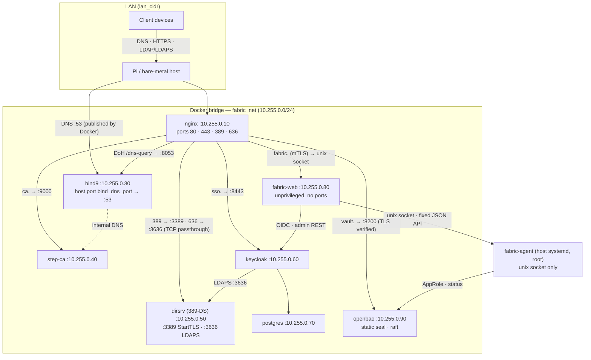
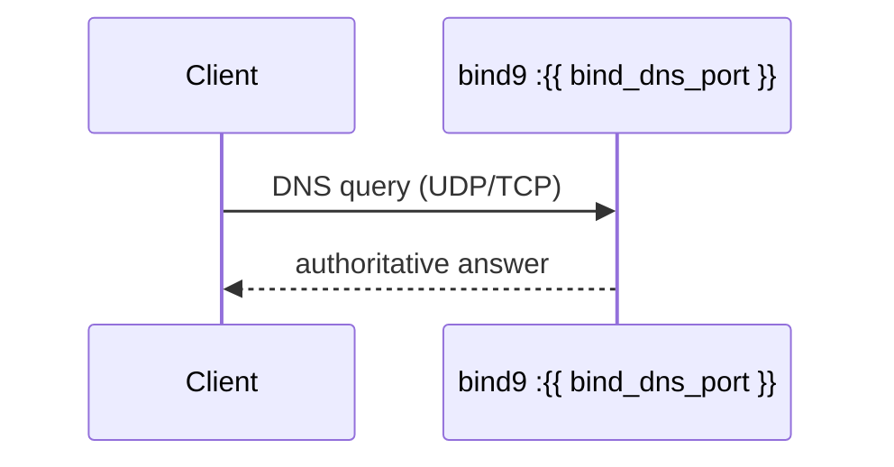
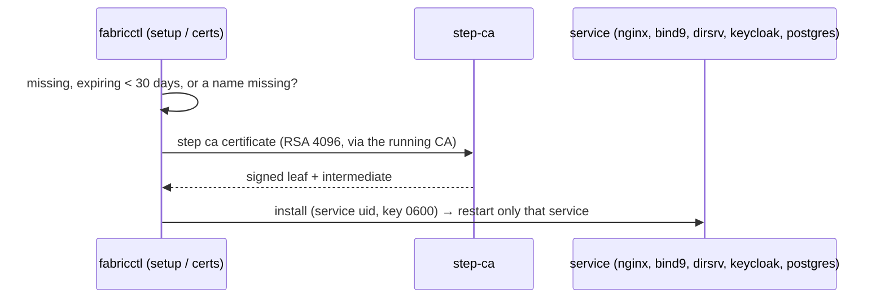

# Architecture and Reference

This document provides an in-depth breakdown of the `fabric` infrastructure, covering the request flows, the underlying directory structures (both source and target), and technical references for PKI, DNS, and Jinja2 rendering.

### Table of Contents
- [Repository Structure](#repository-structure)
- [Target Deployment Structure](#target-deployment-structure)
- [System Topology](#system-topology)
- [Container Hardening](#container-hardening)
- [Dynamic Resource Constraints & Boot Staggering](#dynamic-resource-constraints--boot-staggering)
- [DNS Architecture](#dns-architecture)
- [Request flow — DNS](#request-flow--dns)
- [PKI Chain](#pki-chain)
- [Certificate Relay](#certificate-relay)
- [Request flow — TLS certificate issuance](#request-flow--tls-certificate-issuance)
- [Jinja2 Templates](#jinja2-templates)

---

## Repository Structure

```text
.
├── fabricctl/            # the Linux host side: fabricctl, fabric-agent, setup, service templates
│   ├── lib/
│   │   ├── fabriclib/    # domain code, one operation per file (setup/, dns/, dhcp/, radius/, vault/, …)
│   │   ├── agent/        # fabric-agent: the privileged host API behind the web UI
│   │   ├── deploy.py     # render every template from vars.yaml and apply changes
│   │   ├── interactive.py, keycloak_bootstrap.py
│   │   └── manage.sh, certs.sh, dirsrv.sh, vars.sh, output.sh
│   ├── jinja/            # one folder per service (config, compose file, local image build/)
│   ├── examples/vars.yaml
│   ├── images.lock.yaml  # validated images (by digest) and pinned packages
│   ├── link-vars-template.yaml
│   └── VERSION
├── webui/                # Open Fabric, the control-plane web UI (its own container)
│   ├── server.py, views.py, agentclient.py, oidc.py, tlsclient.py, devserver.py
│   └── Dockerfile
├── installers/
│   └── deb/              # the Debian package: assemble-tree.sh, build-deb.sh, install-from-checkout.sh
├── docs/
└── tests/                # one folder per suite; run-all.sh
```

The package assembles the installed tree from `fabricctl/` and `webui/`
(`installers/deb/assemble-tree.sh`): `fabricctl/` becomes
`/usr/lib/fabricctl/fabric/`, `webui/` its `lib/webui/`, and `fabricctl setup`
copies that to `/opt/fabric/`. The installed layout did not change when the
repository was split (design D25).

---

## Target Deployment Structure

Everything lives under `deploy_base_dir` (default `/opt`). Optional services get their folder only when they are installed.

```text
/opt/
├── fabric              # The install: the packaged tree copied from /usr/lib/fabricctl/fabric by `fabricctl setup`
│   ├── lib/            # fabriclib, fabric-agent (agent/), the web UI app (webui/), deploy.py, interactive.py, manage.sh, …
│   ├── jinja/          # Templates (the sources; only rendered output goes to the service folders)
│   ├── docs/           # This documentation (also served as the manual)
│   ├── VERSION, BUILD, images.lock.yaml
│   ├── config/         # fabric.yaml (the settings setup renders from), vars.yaml (rendered),
│   │                   # link-vars.yaml, secrets.openbao (marker: fabric's secrets are in OpenBao at fabric/secrets;
│   │                   # fabric-secrets.yml exists only until the vault step)
│   └── archive/        # audit.log, issued-certs.jsonl, earlier vars.yaml copies
├── bind9               # config/ (named.conf*, rndc.key), data/ (db.* zones + journals), log/, cache/, ssl/, build/
├── nginx               # config/ (nginx.conf, conf.d/), certs/ (per vhost; client-ca/ca-bundle.pem for web UI mTLS),
│                       # www/ (certs, landing, ldap, manual, shared)
├── stepca              # data/ (certs, config, secrets, templates), build/
├── openbao             # config/ (openbao.hcl), data/ (Raft), logs/ (audit), certs/
├── dirsrv              # data/ (389-DS /data: config, db, logs; tls/ imported on start), seed/ (seed.py + *.ldif, root:ldap 0640), build/
├── keycloak, postgres  # with Keycloak: keycloak/data, postgres/data (or keycloak_data_dir / postgres_data_dir), */certs, keycloak/build
├── webui               # with the web UI: config/webui.json (OIDC secret; webui uid, 0400), build/ (Dockerfile + app/),
│                       # run/web.sock (dir webui:nginx 0750, mounted into nginx at /srv/webui),
│                       # agent/agent.sock (fabric-agent socket, 0660 root:webui; mounted ro into the container)
├── kea                 # optional: config/, leases/, run/ (control socket), build/
├── freeradius          # optional: config/ (incl. client secrets), certs/, python/ (fabric's policy code), build/
└── fluentbit           # optional: config/ (incl. secrets.env), buffer/
```

Each service folder also holds its rendered `docker-compose.yml`; each service's systemd unit (`/etc/systemd/system/<unit>.service`) is part of `fabric.target`. OpenBao's unlock methods live in `/etc/fabric/openbao` (root only); its key is only ever in RAM (`/run/fabric/openbao`).

---

## System Topology



Optional services: `kea-dhcp4` (host network, DHCP on the LAN) with `kea-ddns` (10.255.0.97, dynamic updates into BIND9), `freeradius` (10.255.0.98, UDP 1812/1813 on `host_ip`, asks 389-DS over LDAPS) and `fluentbit` (10.255.0.95, reads the host journal and OpenBao's audit log).

---

## Container Hardening

Every container runs non-root, with `cap_drop: ALL` and **no** capabilities added back, `no-new-privileges` and a read-only root filesystem (writable paths are volumes or small tmpfs mounts). The one documented exception is the optional `kea-dhcp4`: DHCP needs the LAN interface itself, so it runs in the host network as root inside the container with exactly `NET_RAW` and `NET_BIND_SERVICE` (still read-only, `no-new-privileges`). Memory limits: OpenBao, Kea, FreeRADIUS and Fluent Bit always have one (`*_mem_limit`); the others get one from `host_ram_capacity` (below). Proven by the `hardening` test suite (`sudo tests/run-all.sh hardening`), which starts the real rendered compose files and checks each process from the host, including zero effective capabilities.

Where an upstream image fights these settings, a thin **local build layer** (`fabricctl/jinja/<svc>/build/Dockerfile`, deployed to `/opt/<svc>/build`, image `fabric/<svc>:local`) fixes it once at build time instead of as root at every start. It always builds `FROM` the image given in `image_<svc>` (to be a pinned digest from the image channel).

| Container | User | Local layer | Writable paths |
|---|---|---|---|
| `nginx` | `nginx` 443 | — | tmpfs: `/tmp`, `/var/cache/nginx`, `/var/run`, `/var/log/nginx` |
| `bind9` | `bind` 53 | Yes: bind uid/gid baked in, runs `named` directly as `bind` (no root entrypoint, no SETUID/SETGID/CHOWN) | volumes: data, cache, log; tmpfs: `/run/named`, `/tmp` |
| `step-ca` | `step` 135 | Yes: strips the upstream binary's `cap_net_bind_service` file capability (a no-new-privileges container refuses to exec it; step-ca listens on 9000 and never needed it) | volume: `/home/step`; tmpfs: `/tmp` |
| `dirsrv` | `ldap` 911 | Yes: Debian `389-ds-base` build | volume: `/data`; tmpfs: `/tmp`, `/run` |
| `postgres` | `postgres` 901 | — | volume: data; tmpfs: `/var/run/postgresql`, `/tmp` |
| `keycloak` | 900:0 | Yes: pre-built (`kc.sh build`) so it starts with `start --optimized` — no re-augmentation at boot (read-only root, faster on a Pi) | volume: `/opt/keycloak/data`; tmpfs: `/tmp` |
| `webui` | `webui` 912 | Yes: Debian + python3-jinja2 + app | tmpfs: `/tmp`; its socket dir |
| `openbao` | `openbao` 913 | — (pinned upstream image; `bao server` runs directly instead of the root-oriented entrypoint, `init: true` reaps) | volumes: data (Raft), logs (audit); seal key read-only; tmpfs: `/tmp` |
| `fluentbit` (optional) | `fluentbit` 914 | — | volume: buffer; journal and OpenBao audit log read-only |
| `kea-dhcp4` / `kea-ddns` (optional) | root in the container / `kea` 915 | Yes: Debian + Kea 3.0 LTS from ISC's signed repository (version and key pinned in `images.lock.yaml`) | volumes: leases, run (control socket); tmpfs: `/tmp` |
| `freeradius` (optional) | `freeradius` 916 | Yes: Debian `freeradius` + fabric's python3 policy | tmpfs: `/tmp`, `/run/freeradius` |

Low ports need no capability: Docker sets `net.ipv4.ip_unprivileged_port_start=0` inside each container's network namespace.

`apply` rebuilds a local layer only when its build context changed or it was built from another base than its pinned one; every base is pinned by digest (`fabricctl/images.lock.yaml`), and `fabricctl images update` moves bases and pulled images to the validated list (health-gated, with rollback).

---

## Dynamic Resource Constraints & Boot Staggering

To guarantee stability on resource-constrained hardware (e.g. Raspberry Pi), `fabric` natively enforces dynamic memory ceilings (`mem_limit`) and staggered boot sequences across its Docker containers via the `host_ram_capacity` variable.

### Validation Enforcement
The minimum supported value for `host_ram_capacity` is **3** (GB). If defined (i.e. `> 0`) but less than 3, `fabricctl setup` and the `fabricctl` interactive engine hard-fail to prevent the system from entering an unstable state. A value of `0` denotes an unlimited capacity (the default).

### Docker Compose Memory Ceilings
When `host_ram_capacity` is enabled, Jinja2 automatically injects memory constraints into the `docker-compose.yml` templates for all active services.

**At 3GB Capacity:**
The services are strictly clamped to their minimal footprint, leaving sufficient overhead for the host OS.
- Keycloak: `800M`
- Postgres: `100M`
- 389-DS: `256M` (plus `DS_MEMORY_PERCENTAGE=10`)
- BIND9: `40M`
- Nginx: `128M`
- Step-CA: `30M`
- webui: `96M` (3–4GB only)

**At 4GB+ Capacity:**
- Keycloak and Postgres proportionally expand to utilize available memory:
  - Keycloak: `1200M * (host_ram_capacity / 4)`
  - Postgres: `200M * (host_ram_capacity / 4)`
- At exactly 4GB, Nginx, BIND9, Step-CA, 389-DS and webui are capped at `256M`, `80M`, `50M`, `384M` and `96M`. If the host RAM is 5GB or higher, these lightweight services are uncapped.

> [!WARNING]
> **JVM Memory Scaling (Keycloak)**
> Because Keycloak runs on a Java Virtual Machine (JVM), applying a rigid Docker `mem_limit` without instructing the JVM about it can cause blind memory allocation leading to an abrupt OOM-kill. To prevent this, when `host_ram_capacity > 0`, the templates dynamically compute and inject `JAVA_OPTS_APPEND=-Xmx{HeapSize}` into the Keycloak container, sizing the heap to exactly 80% of the calculated Docker ceiling.

### Staggered Boots
If the server cold-boots with a low capacity (`3 <= host_ram_capacity <= 4`), parallel spin-up of all containers can trigger a "thundering herd" resource exhaustion, overloading the CPU and crashing the system before initialization completes.

To mitigate this, artificial boot delays (`ExecStartPre=/bin/sleep N`) are automatically injected into the `systemd` wrapper templates, forcing the following strict sequence:
1. **Postgres**: Boots immediately (`0s`).
2. **Keycloak**: Waits `15s` for Postgres to stabilize.
3. **Rest of Stack**: every other unit (nginx, BIND9, 389-DS, Step-CA, OpenBao, the web UI and the optional services) waits `30s` (15s after Keycloak).

---

## DNS Architecture

BIND9 runs as an **authoritative-only** server (recursion disabled). It serves:
- Internal forward zones defined in the `dns:` block of the vars file (`dynamic_zone_var` key resolved to `domain` at render time)
- Each zone with `zone_authority: true` gets an NS A record pointing to `host_ip`
- Reverse zones (PTR) generated at apply from A and AAAA records by `fabriclib/dns/reverse_zones.py`. There is one `/24` `in-addr.arpa` zone per IPv4 subnet and one `/64` `ip6.arpa` zone per ULA prefix, with one PTR per address. Only private addresses (RFC 1918, 100.64/10, ULA) get one; zones written by hand in `dns:` are left alone. See [operations.md](operations.md#reverse-dns)
- RFC2136 updates, deny-by-default: per key `records` → only `_acme-challenge.<record>.<zone>`; `primary` → `subdomain _acme-challenge`; explicit `any_name` → `zonesub`; plus the grants of any ACL policy (`bind_acl_policies`) the key is a member of. Keys live in vars, their secrets with fabric's secrets in OpenBao (managed with `fabricctl tsig`)

BIND9 answers plain DNS itself; nginx fronts only DNS-over-HTTPS:

```
host_ip:<bind_dns_port> TCP/UDP → bind9:53     plain DNS (published by Docker)
:443 dns.<domain>/dns-query     → bind9:8053   DNS-over-HTTPS (nginx terminates TLS)
```

`bind_dns_port` (default `53`) is the Docker host port mapped to BIND9's internal port 53, published on `host_ip` only (so it does not clash with `systemd-resolved` on loopback). DNS-over-TLS (853) is not exposed yet.

---

## Request flow — DNS



---

## PKI Chain

```
Root CA  (Step-CA's own, created by `step ca init` at setup; or bring your own with `byoc: true`)
    └── Step-CA Intermediate CA
            ├── Service certs  (issued by the running CA during setup's `certs` step)
            │       ├── dns.<domain>      → nginx DoH, BIND9
            │       ├── ldap.<domain>     → 389-DS (StartTLS + LDAPS, served by dirsrv itself)
            │       ├── ca.<domain>, certs.<domain>, vault.<domain> (nginx and OpenBao), the landing page
            │       ├── sso.<domain> (nginx, Keycloak) and postgres (Keycloak's database), with Keycloak
            │       ├── radius.<domain>   → FreeRADIUS EAP server cert (optional)
            │       └── fabric.<domain>   → nginx → web UI (only when install_webui)
            ├── Web UI client certs  (setup's first admin; fabricctl client-cert <user>; CN = Keycloak username)
            ├── Hand-issued certs    (web UI Step-CA tab: signed CSRs, generated key pairs; capped by pki_manual_max_days)
            └── extra_certs          (signed offline with the intermediate key, per-entry config)
```

By default setup lets Step-CA create its own root and intermediate (keys in `/opt/stepca/data/secrets`, readable by the `step` user only). With `byoc: true` the root certificate, intermediate certificate and intermediate key come from `ca_crt_path`, `ica_crt_path` and `ica_key_path`; the root key never reaches the host. Step-CA also serves ACME and signs leaf certs via its intermediate CA. DNS-01 challenges can be fulfilled via a zone's TSIG key (RFC2136).

With BYOC the intermediate key path defaults to `ica_crt_path` with `.crt` replaced by `.key`; set `ica_key_path` in the vars file to override it.

Internal CA files are distributed to services as `root_ca.crt` volume mounts. The PKI info page is available at two URLs:

- `https://ca.<domain>/pki/` — hosted on the Step-CA vhost
- `https://landing_page_cname.<domain>/` — dedicated vhost with theme selector and clean download URLs (`/root_ca.crt`, `/intermediate_ca.crt`)

---

## Certificate Relay

Core service certificates (`dns.<domain>`, `ldap.<domain>`, `ca.<domain>`, `certs.<domain>`, `vault.<domain>`, the landing page, `sso.<domain>` and `postgres` with Keycloak, `fabric.<domain>` with the web UI, `radius.<domain>` with FreeRADIUS) are Step-CA leaf certs (`cert_service_days`, default 365 days) issued by the running CA (`step ca certificate`) during setup's `certs` step, and renewed by setup or `fabricctl certs` when missing, within 30 days of expiry, or missing a name. `extra_certs` and admin client certificates are signed offline with the intermediate. There is no certbot container, cert-relay service or renewal timer. nginx reads the issued certs directly from the volume paths set during install. The LDAP cert is copied to `/opt/dirsrv/data/tls/` (`server.crt`, `server.key`, `ca/root_ca.crt`, `ca/intermediate_ca.crt`), which 389-DS imports on start. For webui client-certificate verification nginx trusts `/opt/nginx/certs/client-ca/ca-bundle.pem` (intermediate + root).

---

## Request flow — TLS certificate issuance



---

## Jinja2 Templates

All `.j2` files are rendered by the `fabricctl` deployment engine (`fabricctl/lib/deploy.py`, and for the optional services `fabriclib/dhcp/deploy_kea.py`, `fabriclib/radius/deploy_freeradius.py`, `fabriclib/logs/deploy_fluentbit.py`; shared Jinja environment `fabriclib/common/jinja_env.py`) via `/tmp/fabric-render` into `/opt/<service>/`. The service folders hold only rendered output; the templates themselves stay in the installed tree (`/opt/fabric/jinja`).

| Template | Rendered to |
|----------|------------|
| `fabricctl/jinja/vars.yaml.j2` | `/tmp/fabric-render/vars.yaml` (resolved vars — merged at run time) |
| `fabricctl/jinja/<service>/docker-compose.yml.j2` | `/opt/<service>/docker-compose.yml` (e.g. nginx, bind9) |
| `fabricctl/jinja/nginx/nginx.conf.j2` | `/opt/nginx/config/nginx.conf` |
| `fabricctl/jinja/nginx/www/*/index.html.j2` | `/opt/nginx/www/{certs,landing,manual,ldap}/index.html` (certs: served at `certs.<domain>` and `http://<host_ip>/certs/`) |
| `fabricctl/jinja/bind9/config/named.conf*.j2` | `/opt/bind9/config/named.conf*` |
| `fabricctl/jinja/bind9/data/zone.j2` | `/opt/bind9/data/db.<zone>` (forward zones) |
| `fabricctl/jinja/bind9/data/reverse-zone.j2` | `/opt/bind9/data/db.<reverse zone>` (`in-addr.arpa` /24 and `ip6.arpa` /64 PTR zones — auto-generated) |
| `fabricctl/jinja/dirsrv/seed/*.ldif.j2` | `/opt/dirsrv/seed/*.ldif` (applied by `seed.py` via `dirsrv.sh seed`) |
| `fabricctl/jinja/dirsrv/seed.py` | `/opt/dirsrv/seed/seed.py` (copied, not rendered) |
| `fabricctl/jinja/webui/webui.json.j2` | `/opt/webui/config/webui.json` |
| `webui/Dockerfile` + `webui/*.py` (installed as `jinja/webui/build/` and `lib/webui/`) | `/opt/webui/build/` (+ `app/`) — copied, not rendered; image `fabric/web:local` (container and unit `fabric-web`) |
| `fabricctl/jinja/<svc>/build/*` | `/opt/<svc>/build/` — copied, not rendered (local image layers) |
| `fabricctl/jinja/systemd/wrapper.service.j2` | `/etc/systemd/system/<unit>.service` (one per service; `fabric.target` copied as is) |
| `fabricctl/jinja/systemd/fabric-agent.service.j2` | `/etc/systemd/system/fabric-agent.service` |
| `fabricctl/jinja/stepca/leaf.tpl.j2` | `/opt/stepca/data/templates/certs/leaf.tpl` |
| `fabricctl/jinja/stepca/subca.tpl.j2` | `/opt/stepca/data/templates/certs/subca.tpl` |
| `fabricctl/jinja/openbao/openbao.hcl.j2` | `/opt/openbao/config/openbao.hcl` |
| `fabricctl/jinja/kea/*.conf.j2`, `freeradius/config/**`, `fluentbit/fluent-bit.yaml.j2` | `/opt/kea/config/`, `/opt/freeradius/config/`, `/opt/fluentbit/config/` (optional services) |
