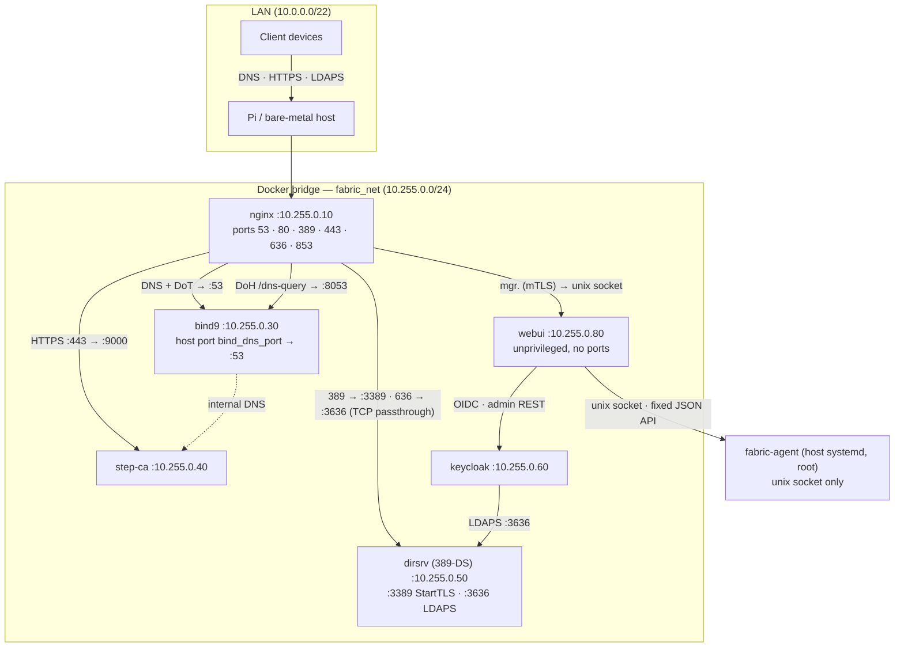
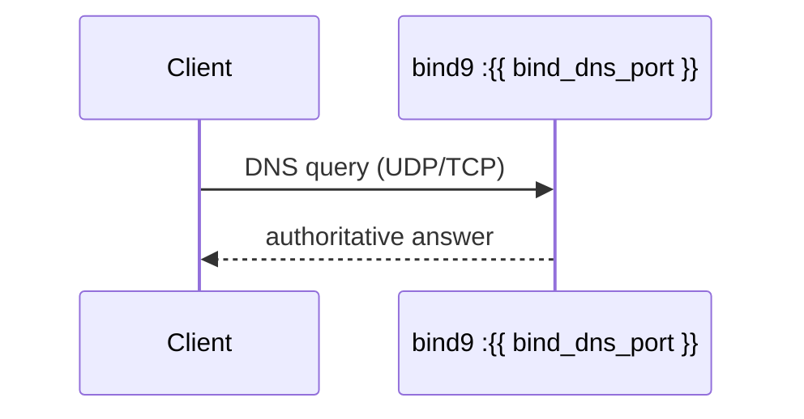
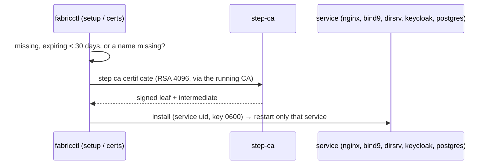

# Architecture and Reference

This document provides an in-depth breakdown of the `fabric` infrastructure, covering the request flows, the underlying directory structures (both source and target), and technical references for PKI, DNS, and Jinja2 rendering.

### Table of Contents
- [Repository Structure](#repository-structure)
- [Target Deployment Structure](#target-deployment-structure)
- [System Topology](#system-topology)
- [Dynamic Resource Constraints & Boot Staggering](#dynamic-resource-constraints--boot-staggering)
- [DNS Architecture](#dns-architecture)
- [Request flow — DNS](#request-flow--dns)
- [PKI Chain](#pki-chain)
- [Certificate Relay](#certificate-relay)
- [Request flow — TLS certificate issuance](#request-flow--tls-certificate-issuance)
- [Jinja2 Templates](#jinja2-templates)

---

## Repository Structure

```text
.
├── fabric
│   ├── jinja
│   │   ├── bind9
│   │   ├── webui         # docker-compose.yml.j2, webui.json.j2, build/Dockerfile
│   │   ├── dirsrv          # docker-compose.yml.j2, seed.py, seed/*.ldif.j2
│   │   ├── docker-compose.yml.j2
│   │   ├── nginx
│   │   ├── stepca
│   │   ├── systemd         # wrapper.service.j2, fabric-agent.service.j2
│   │   └── vars.yaml.j2
│   ├── lib
│   │   ├── fabriclib/    # domain code, one operation per file (common/, dns/, system/, pki/, security/)
│   │   │   ├── setup/    # fabricctl setup/doctor/certs/reinstall/uninstall: one step per file
│   │   │   └── cli.py    # lifecycle command router
│   │   ├── agent/        # fabric-agent: privileged host API for webui (routes to fabriclib)
│   │   ├── webui/        # webui container app (server, oidc, tlsclient, agentclient, views)
│   │   ├── certs.sh
│   │   ├── deploy.py
│   │   ├── dirsrv.sh
│   │   ├── interactive.py
│   │   ├── keycloak_bootstrap.py
│   │   ├── ldap_migrate.py
│   │   ├── ldap_migrate.sh
│   │   ├── manage.sh
│   │   ├── output.sh
│   │   ├── tsig.sh
│   │   └── vars.sh
│   └── VERSION             # fabricctl version (BUILD is stamped by setup.sh, git-ignored)
├── custom-vars.yaml
├── docs
│   ├── architecture.md
│   ├── webui.md
│   ├── install.md
│   ├── keycloak.md
│   ├── lib-doc.md
│   ├── operations.md
│   ├── subordinate.md
│   ├── testplan.md
│   └── vars.md
├── setup.sh
└── tests
```

---

## Target Deployment Structure

```text
/opt/
├── bind9               # Managed: configs and zones updated by installer
│   ├── cache           # Persistent: BIND9 cache data
│   ├── config          # Managed: named.conf*, rndc.key managed by idempotent deploy
│   ├── data            # Managed: db.* (zones) managed by idempotent deploy (except dynamic journals)
│   ├── docker-compose.yml # Managed: Re-rendered and managed by idempotent deploy
│   └── log             # Persistent: BIND9 log directory
├── fabric              # Managed/Persistent mix
│   ├── archive         # Persistent: Automated snapshots and audit logs
│   ├── fabric-secrets.yml # Persistent: Safely preserved secrets for TLS and DNS
│   ├── lib/            # Managed: Utility library with python engines and bash wrappers
│   │   ├── deploy.py   # Managed: Python rendering and state-aware deployment engine
│   │   ├── interactive.py # Managed: Python interactive categorical CLI engine
│   │   └── manage.sh   # Managed: Legacy shell function wrapper
│   ├── src/            # Managed: A full mirror of the deployment repository
│   └── vars.yaml       # User-managed: Safely merged and preserved
├── webui             # Managed (only when install_webui)
│   ├── docker-compose.yml # Managed: unprivileged webui container
│   ├── build/        # Managed: image build context (Dockerfile + app/ = fabric/lib/webui)
│   ├── config/webui.json # Managed: webui config incl. OIDC client secret (webui uid, 0400; dir root:webui 0750)
│   ├── run/web.sock    # Runtime: created by the container (dir webui:nginx 0750), mounted into nginx at /srv/webui
│   └── agent/agent.sock # Runtime: fabric-agent socket (0660 root:webui; dir root:webui 0750), mounted ro into webui
├── dirsrv              # Managed/Persistent mix
│   ├── data            # Persistent: 389-DS /data (config, db, logs)
│   │   └── tls         # Managed: server.crt, server.key, ca/*.crt (imported into NSS on start)
│   ├── seed            # Managed: seed.py + 00-config/10-tree/20-accounts/30-aci .ldif (root:ldap 0640)
│   └── docker-compose.yml # Managed
├── nginx               # Managed: config updated by installer
│   ├── docker-compose.yml # Managed: Re-rendered and managed by idempotent deploy
│   ├── certs           # Managed: service certs; client-ca/ca-bundle.pem (webui mTLS trust)
│   ├── config          # Managed: Nginx main and stream configurations
│   │   ├── nginx.conf  # Managed: Main config managed by idempotent deploy
│   │   ├── dns.conf    # Managed: DNS stream routing
│   │   └── conf.d      # External configs (e.g., adguard-web.conf)
│   └── www             # Managed: Static content root
│       ├── certificates# Managed: PKI/Certificate installation portal
│       ├── landing     # Managed: Infrastructure Landing Portal
│       ├── ldap        # Managed: LDAP Client guides
│       ├── manual      # Managed: Core infrastructure manual
│       └── shared      # Managed: Shared CSS/assets
└── stepca              # Persistent: Internally manages certs, keys, and DB
    ├── docker-compose.yml # Managed
    └── data            # Persistent: PKI database, certs, and configurations
        ├── certs       # Persistent
        ├── config      # Persistent
        ├── secrets     # Persistent
        └── templates   # Managed: leaf.tpl and subca.tpl managed by idempotent deploy
```

---

## System Topology



---

## Container Hardening

Every container runs non-root, with `cap_drop: ALL` and **no** capabilities added back, `no-new-privileges`, a read-only root filesystem (writable paths are volumes or small tmpfs mounts), and a memory limit. Proven by the `hardening` test suite (`sudo tests/run-all.sh hardening`), which starts the real rendered compose files and checks each process from the host, including zero effective capabilities.

Where an upstream image fights these settings, a thin **local build layer** (`fabric/jinja/<svc>/build/Dockerfile`, deployed to `/opt/<svc>/build`, image `fabric/<svc>:local`) fixes it once at build time instead of as root at every start. It always builds `FROM` the image given in `image_<svc>` (to be a pinned digest from the image channel).

| Container | User | Local layer | Writable paths |
|---|---|---|---|
| `nginx` | `nginx` 443 | — | tmpfs: `/tmp`, `/var/cache/nginx`, `/var/run`, `/var/log/nginx` |
| `bind9` | `bind` 53 | Yes: bind uid/gid baked in, runs `named` directly as `bind` (no root entrypoint, no SETUID/SETGID/CHOWN) | volumes: data, cache, log; tmpfs: `/run/named`, `/tmp` |
| `step-ca` | `step` 135 | Yes: strips the upstream binary's `cap_net_bind_service` file capability (a no-new-privileges container refuses to exec it; step-ca listens on 9000 and never needed it) | volume: `/home/step`; tmpfs: `/tmp` |
| `dirsrv` | `ldap` 911 | Yes: Debian `389-ds-base` build | volume: `/data`; tmpfs: `/tmp`, `/run` |
| `postgres` | `postgres` 901 | — | volume: data; tmpfs: `/var/run/postgresql`, `/tmp` |
| `keycloak` | 900:0 | Yes: pre-built (`kc.sh build`) so it starts with `start --optimized` — no re-augmentation at boot (read-only root, faster on a Pi) | volume: `/opt/keycloak/data`; tmpfs: `/tmp` |
| `webui` | `webui` 912 | Yes: Debian + python3-jinja2 + app | tmpfs: `/tmp`; its socket dir |

Low ports need no capability: Docker sets `net.ipv4.ip_unprivileged_port_start=0` inside each container's network namespace.

`apply` rebuilds a local layer (without `--pull`) only when its build context changed; `fabricctl --update-containers` rebuilds all of them with `--pull`.

---

## Dynamic Resource Constraints & Boot Staggering

To guarantee stability on resource-constrained hardware (e.g. Raspberry Pi), `fabric` natively enforces dynamic memory ceilings (`mem_limit`) and staggered boot sequences across its Docker containers via the `host_ram_capacity` variable.

### Validation Enforcement
The minimum supported value for `host_ram_capacity` is **3** (GB). If defined (i.e. `> 0`) but less than 3, the `setup.sh` installer and `fabricctl` interactive Python engine will hard-fail to prevent the system from entering an unstable state. A value of `0` denotes an unlimited capacity (the default).

### Docker Compose Memory Ceilings
When `host_ram_capacity` is enabled, Jinja2 automatically injects memory constraints into the `docker-compose.yml` templates for all active services.

**At 3GB Capacity:**
The services are strictly clamped to their minimal footprint, leaving sufficient overhead for the host OS.
- Keycloak: `800M`
- Postgres: `100M`
- 389-DS: `256M` (plus `DS_MEMORY_PERCENTAGE=10`)
- BIND9: `40M`
- Nginx: `15M`
- Step-CA: `30M`
- webui: `96M` (3–4GB only)

**At 4GB+ Capacity:**
- Keycloak and Postgres proportionally expand to utilize available memory:
  - Keycloak: `1200M * (host_ram_capacity / 4)`
  - Postgres: `200M * (host_ram_capacity / 4)`
- Nginx, BIND9, and Step-CA limits remain capped at their peak efficient usage (`40M`, `80M`, `50M` respectively) and 389-DS at `384M` if `host_ram_capacity == 4`. If the host RAM is 5GB or higher, these lightweight services are fully uncapped as they pose zero threat to system stability.

> [!WARNING]
> **JVM Memory Scaling (Keycloak)**
> Because Keycloak runs on a Java Virtual Machine (JVM), applying a rigid Docker `mem_limit` without instructing the JVM about it can cause blind memory allocation leading to an abrupt OOM-kill. To prevent this, when `host_ram_capacity > 0`, the templates dynamically compute and inject `JAVA_OPTS_APPEND=-Xmx{HeapSize}` into the Keycloak container, sizing the heap to exactly 80% of the calculated Docker ceiling.

### Staggered Boots
If the server cold-boots with a low capacity (`3 <= host_ram_capacity <= 4`), parallel spin-up of all containers can trigger a "thundering herd" resource exhaustion, overloading the CPU and crashing the system before initialization completes.

To mitigate this, artificial boot delays (`ExecStartPre=/bin/sleep N`) are automatically injected into the `systemd` wrapper templates, forcing the following strict sequence:
1. **Postgres**: Boots immediately (`0s`).
2. **Keycloak**: Waits `15s` for Postgres to stabilize.
3. **Rest of Stack**: Nginx, BIND9, 389-DS, and Step-CA wait `30s` (15s after Keycloak).

---

## DNS Architecture

BIND9 runs as an **authoritative-only** server (recursion disabled). It serves:
- Internal forward zones defined in the `dns:` block of `custom-vars.yaml` (`dynamic_zone_var` key resolved to `domain` at render time)
- Each zone with `zone_authority: true` gets an NS A record pointing to `host_ip`
- Reverse zones (PTR) auto-generated from A records — one `/24` `in-addr.arpa` zone per unique subnet; `reverse_zone_names` computed in `vars.yaml.j2`
- ACME challenge and zone records updateable per `tsig_keys[].record_types` (primary keys → `subdomain _acme-challenge`; others → `zonesub`)
- Any additional keys managed by `fabricctl --tsig-keys`

nginx fronts BIND9 on all public DNS ports:

```
:53  TCP/UDP  → bind9:53   plain DNS
:853 TCP      → bind9:53   DNS-over-TLS  (nginx terminates TLS)
:443 /dns-query → bind9:8053          DNS-over-HTTPS (nginx terminates TLS)
```

`bind_dns_port` (default `53`) is the Docker host port mapped to BIND9's internal port 53. BIND9 only listens on port 53 inside the container; Docker publishes it on `bind_dns_port` on the host. If a user installs the `home-core` add-on, `bind_dns_port` is shifted to `5353` to allow AdGuard Home to natively claim port 53.

---

## Request flow — DNS



---

## PKI Chain

```
Root CA  (offline — manually generated, key never deployed to target)
    ├── Standalone leaf certs  (signed offline)
    └── Step-CA Intermediate CA  (signed offline)
            ├── BIND9 static TLS cert   (offline via step-ca, ~15 years)
            ├── Offline leaf certs      (issued at install time via step-ca)
            │       ├── dns.<domain>    → nginx DoT / DoH
            │       ├── ldap.<domain>   → 389-DS (StartTLS + LDAPS, served by dirsrv itself)
            │       ├── mgr.<domain>    → nginx → webui (only when install_webui)
            │       └── ca.<domain>     → nginx → Step-CA
            ├── webui admin client certs  (fabricctl --client-cert <user>; CN = Keycloak username)
            └── extra_certs  (offline or ACME, per-entry config)
```

The root CA key is generated on the operator's machine before install and is **never deployed to the target**. After signing the intermediate CA, it can be stored offline or destroyed. The installer deploys only `root_ca.crt` (public), `intermediate_ca.crt` (public), and `intermediate_ca.key` (secret — step-ca uses this at runtime). Step-CA serves as the ACME endpoint and signs all runtime leaf certs via its intermediate CA. DNS-01 challenges can be fulfilled via the primary TSIG key (`acme_dns-01`).

The intermediate CA key is automatically derived from the `ica_crt_path` by default exchanging the `.crt` extension for `.key`. This can be overridden explicitly in `custom-vars.yaml` or with `--ica-key <path>`.

Internal CA files are distributed to services as `root_ca.crt` volume mounts. The PKI info page is available at two URLs:

- `https://ca.<domain>/pki/` — hosted on the Step-CA vhost
- `https://landing_page_cname.<domain>/` — dedicated vhost with theme selector and clean download URLs (`/root_ca.crt`, `/intermediate_ca.crt`)

---

## Certificate Relay

Core service certificates (`dns.<domain>`, `ldap.<domain>`, `ca.<domain>`, `landing_page_cname.<domain>`, and `mgr.<domain>` when webui is enabled) are offline Step-CA leaf certs with a 10-year lifetime, issued at install time via `step certificate create`. There is no certbot container or cert-relay service. nginx reads the issued certs directly from the volume paths set during install. The LDAP cert is copied to `/opt/dirsrv/data/tls/` (`server.crt`, `server.key`, `ca/root_ca.crt`, `ca/intermediate_ca.crt`), which 389-DS imports on start. For webui client-certificate verification nginx trusts `/opt/nginx/certs/client-ca/ca-bundle.pem` (intermediate + root).

---

## Request flow — TLS certificate issuance



---

## Jinja2 Templates

All `.j2` files in this repo are rendered by the `fabricctl` deployment engine (`fabric/lib/deploy.py`, shared Jinja environment `fabriclib/common/jinja_env.py`) into `/opt/<service>/`. The `.j2` source files are removed from `/opt` after rendering — only rendered outputs remain on the host.

| Template | Rendered to |
|----------|------------|
| `fabric/jinja/vars.yaml.j2` | `/tmp/fabric-render/vars.yaml` (resolved vars — merged at run time) |
| `fabric/jinja/<service>/docker-compose.yml.j2` | `/opt/<service>/docker-compose.yml` (e.g. nginx, bind9) |
| `fabric/jinja/nginx/nginx.conf.j2` | `/opt/nginx/config/nginx.conf` |
| `fabric/jinja/nginx/www/certificates/index.html.j2` | `/opt/nginx/www/certificates/index.html` |
| `fabric/jinja/nginx/www/ldap/index.html.j2` | `/opt/nginx/www/ldap/index.html` |
| `fabric/jinja/bind9/config/named.conf*.j2` | `/opt/bind9/config/named.conf*` |
| `fabric/jinja/bind9/data/zone.j2` | `/opt/bind9/data/db.<zone>` (forward zones) |
| `fabric/jinja/bind9/data/reverse-zone.j2` | `/opt/bind9/data/db.<octet3>.<octet2>.<octet1>.in-addr.arpa` (PTR — auto-generated) |
| `fabric/jinja/dirsrv/seed/*.ldif.j2` | `/opt/dirsrv/seed/*.ldif` (applied by `seed.py` via `dirsrv.sh seed`) |
| `fabric/jinja/dirsrv/seed.py` | `/opt/dirsrv/seed/seed.py` (copied, not rendered) |
| `fabric/jinja/webui/webui.json.j2` | `/opt/webui/config/webui.json` |
| `fabric/jinja/webui/build/*` + `fabric/lib/webui/` | `/opt/webui/build/` (+ `app/`) — copied, not rendered; image `fabric/webui:local` |
| `fabric/jinja/systemd/fabric-agent.service.j2` | `/etc/systemd/system/fabric-agent.service` |
| `fabric/jinja/stepca/leaf.tpl.j2` | `/opt/stepca/data/templates/certs/leaf.tpl` |
| `fabric/jinja/stepca/subca.tpl.j2` | `/opt/stepca/data/templates/certs/subca.tpl` |
