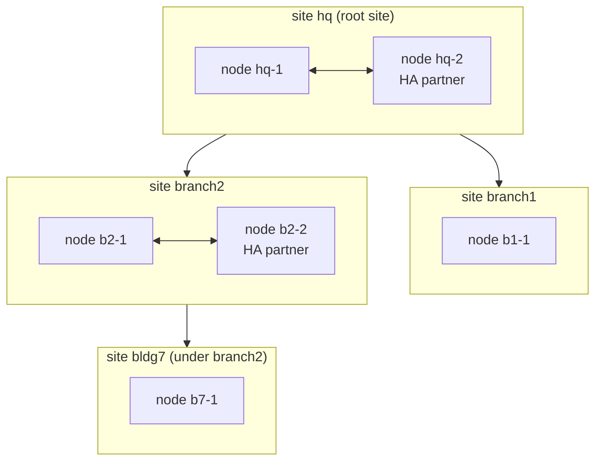

# Design: federation — sites, upstream/downstream, HA partners

Status: **being built** (branch `feature/federation`; §8a). Owner decisions
so far: a downstream can be a **branch site** or an **HA partner** within the
same site; sites attach to the root **flat** (the default), **through a
relay node**, or **nested** under another site (§6); every site keeps
working when its upstream goes away (§3.3); **upstream owns identity**.
Where an application has no HA of its own, **failover** (a standby an admin
promotes) is enough — no failover machinery is engineered at this stage.

## 1. Terms

| Term | Meaning |
|---|---|
| **fabric node** | One fabric install on one host (what exists today) |
| **site** | One location: one node, or two nodes that are **HA partners**. A site has a name (`hq`, `branch1`), its own LAN(s), its own DNS sub-zone and its own intermediate CA |
| **upstream / downstream** | Sites form a tree. The top site (the **root site**) owns identity and the root CA; each downstream site is attached to exactly one upstream site: the root (**flat**, the default), the root through a relay **node**, or another site that owns it (**nested**, opt-in) — see §6 |
| **HA partner** | The second node of a site. Partners are peers in the same site, never across sites |
| **join** | Attaching a new node to a site (as partner) or a new site to an upstream (as branch), once, with a one-time invitation |



## 2. Who owns what

**Upstream owns identity; each site owns its local network.**

| Data | Owner | Other sites get |
|---|---|---|
| People, groups (incl. the RBAC bundle groups), device roles | root site | a read-only copy |
| The root CA | root site | its certificate (trust anchor) |
| Permissions and bundles (the code's `rbac/`) | the software | identical everywhere |
| A site's devices (enrolled at that site) | that site | its upstream (and the root) get a read-only copy |
| A site's subnets, DHCP, switches (RADIUS clients), its DNS sub-zone, its intermediate CA | that site | upstream sees them (read-only; status and names) |
| A site's secrets (OpenBao) | that site | nothing — secrets never leave a site |

A compromised downstream therefore cannot change identity anywhere: it only
holds read-only copies of it, and upstream accepts nothing from it except
its own devices and its own zone.

## 3. What each service does

### 3.1 Within a site: HA partners

Native HA where the application has it; otherwise the partner keeps a
standby copy and an admin promotes it (`fabricctl site promote`, a
documented runbook — no virtual IPs, no automatic takeover at this stage).

| Service | HA partner mode | How clients reach it |
|---|---|---|
| **DNS (BIND)** | Native: one node is primary for the site's zones, the partner a secondary (NOTIFY + IXFR/AXFR, TSIG). Dynamic updates (DHCP names, ACME) go to the primary | DHCP hands out **both** nodes as resolvers: clients fail over by themselves |
| **DHCP (Kea 3.0)** | Native: Kea's HA hook (open source since 3.0), hot-standby, leases synchronised between the partners over HTTPS with mutual TLS (Step-CA certificates) | Both nodes serve the LAN; Kea decides which answers |
| **802.1X (FreeRADIUS)** | Native by design: both nodes answer, decisions come from the local directory copy (no shared state) | Switches list **both** nodes as RADIUS servers |
| **Directory (389-DS)** | Native: multi-supplier replication between the partners (both writable for the site's own data; identity stays read-only, see 3.2) | Each node's services use their local directory |
| **PKI (Step-CA)** | No shared state needed: **each node has its own intermediate CA** (signed by the site's CA); both issue | Either node |
| **Keycloak + Postgres** | Failover: Keycloak runs on the primary; the partner holds a Postgres **streaming replica** (read-only) and a stopped Keycloak | Promote by hand; DNS names (`sso.<site>…`) move with the promote |
| **OpenBao** | Failover: a two-node Raft cluster has no quorum after losing one node, so it would add nothing. The partner keeps **encrypted Raft snapshots** (every N minutes) and its own unlock method | Promote by hand (restore the latest snapshot) |
| **Web UI, fabric-agent, nginx** | Failover: run on the primary; installed but stopped on the partner | Promote by hand |

Why failover is acceptable here: DNS, DHCP and 802.1X — what the LAN
depends on minute to minute — keep working with no action when one node
dies. What needs a promote is the administration side (sign-in, secrets,
the web UI), which can wait for an admin.

#### 3.1a Automatic takeover (owner idea 2026-10-01, to be designed)

The owner's direction for HA, replacing "promote by hand" (decision F8) once designed:

- **Heartbeat.** fabric-agent on each partner keeps a keep-alive with the others (its own port,
  mutual TLS with Step-CA certificates: only fabric nodes of this organisation count).
- **Services are announced.** Every agent tells its linked peers what it runs and in what state
  (active, standby, stopped), so each node knows the whole picture.
- **Takeover.** When a node stops answering, a partner starts the services that have no native HA
  (the failover rows above: Keycloak + Postgres promote, OpenBao from the latest snapshot, web UI,
  nginx, the federation endpoint, a singleton Step-CA role if any).
- **Checked first at start-up.** Before starting any singleton, the agent asks the previously
  linked systems who is active, so a node coming back after a takeover rejoins as standby instead
  of starting a second copy.

Open points to settle before building:
- **Split brain.** With two nodes, "the other stopped answering" and "the link between us broke"
  look the same; both would take over. A third vote is needed: a witness (the upstream site, or a
  tiny witness-only agent) and a node takes over only with a majority. Without a majority it does
  nothing (and says so).
- **Addresses.** Clients and switches reach DNS, DHCP and RADIUS at both nodes already. Names
  (`sso.<domain>`, the web UI) move by a DNS update, or a virtual IP (VRRP) moves with the active
  node.
- **Fencing.** The node that lost must stop its singletons when it notices it lost the majority,
  before the other starts them.
- **Data must already be there.** Takeover only works for what is replicated beforehand: Postgres
  streaming replica, OpenBao snapshots, 389-DS multi-supplier, Kea HA leases, BIND secondaries.

### 3.2 Between sites: upstream/downstream

| Service | Federation |
|---|---|
| **Directory (389-DS)** | Two suffixes per node. The **organisation suffix** (people, groups, device roles) is supplied by the root site and replicated **down** read-only (a consumer at a leaf site, a read-only *hub* at a site that has downstreams). Each site's **site suffix** (`ou=<site>,<org>`: its devices and service accounts, §6) is supplied by that site and replicated **up** read-only. Replication over TLS with certificate authentication. Changes wait in the supplier's changelog while a link is down |
| **Sign-in (Keycloak)** | Each site runs its own Keycloak, federating its **local** directory copy — sign-in works while the upstream is unreachable. Realm settings come from the same code (`keycloak_bootstrap`) everywhere. TOTP enrolment is per site (see decision F2) |
| **RBAC** | Bundle groups replicate with identity. A group applies **everywhere** (`network-operators`) or only to **one site** (`branch1-network-operators`); a site's Keycloak maps global groups and its own site's groups only (decision F4) |
| **PKI** | The root site's CA signs each downstream site's **intermediate** (path length 0 unless the site may hold nested sites, §6; optionally name-constrained to the site's DNS sub-zone, decision F6). Every site trusts the same root: a device certificate from any site is valid everywhere (EAP-TLS roaming, decision F3) |
| **DNS** | The root site owns `<domain>`. Each site serves a **delegated sub-zone** `<site>.<domain>` (NS + glue in the upstream zone), and its DHCP names under `dhcp.<site>.<domain>`. Each side is a **secondary** of the other's zones (TSIG), so names resolve both ways while the link is down |
| **DHCP** | Per site only: a site's subnets are its own; nothing is shared across sites. Upstream sees them read-only |
| **802.1X** | Per site: switches ask their own site; decisions come from the site's local directory copy. No RADIUS proxying between sites (roaming devices: decision F3) |
| **OpenBao** | Per site: every site keeps its own secrets and unlock methods; nothing replicates between sites. (Optional later: a site's encrypted export deposited upstream for disaster recovery) |
| **Images and packages** | Later (with D9/D21): a site pulls the validated image list and images through its upstream, which gives branches an offline path |

### 3.2a Directory replication (M5, how)

Each suffix has exactly one place where it is written; 389-DS replicates it from there:

| Suffix | Written at (supplier) | Copies |
|---|---|---|
| The organisation (`<base>`: people, groups, device roles, host groups and rules) | the root site only (replica id 1, with the changelog) | every site, read-only: a *consumer* at a leaf site, a *hub* at a site that has sites below it (it passes the changes on) |
| A site's part (`ou=<site>,<base>`: its devices, machines, service accounts) | that site (its own replica, changelog) | its parent read-only (a hub when the parent has its own parent, so the part reaches the root); sideways to another site only by consent (F3) |

- **Agreements** are made by the joining flow: the parent and the site each create a replication manager
  for the other, with a random password exchanged inside the TLS join answer (like the TSIG key, M4) and
  kept in OpenBao (`federation_replication`); agreements bind over LDAPS, verified against the
  organisation's root CA. Total update (initialisation) once, then incremental.
- **Reaching each other:** LDAPS (636) of each site must be reachable from its parent and the other way;
  the federation link adds the other site's address to the allowed networks (as for DNS).
- **Read-only where not written:** at a site the organisation suffix refuses writes (consumer/hub), and
  the site's Keycloak federation is READ_ONLY: people, groups and passwords are changed at the root
  (password changes from Linux clients and the web UI are referred there). The web UI's People page and
  `create_person` say so at a site.
- **Offline:** a site keeps answering from its copies (logins, 802.1X, Keycloak sign-in); changes wait in
  the supplier's changelog and arrive when the link is back. A site cut off longer than the changelog's
  retention (7 days by default, settable) is re-initialised automatically.
- **Removing a site** (`remove`) deletes its agreements and its part's copy at the parent.
- **Nested and relays:** replication follows the parent chain (a relay forwards joins only, as for DNS).
- **Tests:** two real 389-DS containers (root and site): a person created at the root appears at the site
  with their POSIX identity; a device added at the site appears at the root; a write to the organisation
  at the site is refused; with the root stopped the site still answers and binds; changes made meanwhile
  arrive afterwards.

### 3.3 Offline behaviour of a branch (and of every site if the root goes away)

Every site runs everything it needs itself, so with its upstream (or the
root site, or a relay) gone, a site keeps: sign-in for people (Keycloak on
its read-only copy of the organisation), DNS for its own zone and (from its
secondary copy) the organisation's zone, DHCP, 802.1X, its web UI, its
secrets (OpenBao), and issuing certificates from its intermediate. Nested
sites below it keep working too.

What waits for the upstream: changes to people, groups and device roles
(read-only at sites); new sites joining through it; renewing the site's own
CA; revocations from elsewhere. The changelog catches up when the link
returns. A site's CA outlives outages comfortably (default three years,
renewed well before expiry); a site whose parent is gone for good is
re-parented (§6).

## 4. Joining

Assuming the right permissions: a new permission `federation:admin` (in the
admin bundle by default) is needed on the upstream to invite, and root on
the joining node.

1. **Invite** — on the upstream (CLI or web UI):
   `fabricctl federation invite branch2 --as site` (a new downstream site) or
   `fabricctl federation invite hq-2 --as partner` (an HA partner).
   Prints a **one-time invitation**: the upstream's federation address, the
   SHA-256 fingerprint of the root CA, and a single-use secret valid for one
   hour. Audited.
2. **Join** — on the new node, at install time:
   `fabricctl setup --join` with the invitation pasted at its prompt (a fresh install; see F1 for
   existing ones). The node connects to the upstream's federation endpoint
   (HTTPS, the server certificate checked against the pinned fingerprint),
   presents the secret and sends certificate requests.
3. **Upstream returns** (and records the site/node in its directory):
   - the root CA and a signed **intermediate** for the new site/node;
   - the organisation settings (domain, organisation suffix, site name);
   - replication credentials (a replication account per site, certificate-bound);
   - the TSIG key for zone transfers, and the NS delegation it added for `<site>.<domain>`;
   - for a partner: the site's settings (subnets, RADIUS clients, Kea HA peer), so both nodes serve the same LAN.
4. **Setup continues** as today, configured as a member: directory created
   as a consumer (plus its own site suffix), Keycloak federating it, DNS
   zones and secondaries, Kea (HA if partner), FreeRADIUS, its own OpenBao.
   Replication starts; `fabricctl doctor` checks the links.

**Leave**: `fabricctl federation leave` (downstream) or `… remove <site>`
(upstream): replication agreements removed, delegation removed, the site's
intermediate revoked (F7). The site keeps its copies and becomes standalone.

## 5. The federation endpoint

A new small API on each node, served by nginx on 443 (`federation.<site>.<domain>`)
and handled by its own minimal root service, `fabric-federation` (not
fabric-agent: it is the only fabric API peers on the network reach, so it
serves only what they need): **mutual TLS** with node certificates from the
fabric CA chain (a node proves which site it is), plus the invitation secret
for the one join call (built: the join alone, authenticated by the secret). Routes: join, renew intermediate, status (for the
upstream's dashboard), and — later — site-local administration from the
upstream (F5). Firewall: peers are allowed to exactly the ports they need
(443 federation, 636 replication, 53 TCP zone transfers; within a site also
Kea HA and Postgres replication), like RADIUS clients today.

## 6. Attachment: flat, through a node, or nested

Chosen per site when it is invited (owner decision 2026-10-01: all three).
The organisation's **root site** is permanent (in the owner's network: `lan`,
made highly available); other sites may be disposable (a `lab` rebuilt for
each round of testing, more labs added).

```
fabricctl federation invite lab                  # on the root: flat, lab links straight to the root site
fabricctl federation invite lab --nest 1         # on the root: flat, and lab may hold one level of sites
fabricctl federation invite lab2                 # on lab: nested, lab owns lab2 (lab signs its CA)
fabricctl federation invite lab3 --via edge1     # flat through a node: edge1 only relays
```

Nested invitations are made on the parent, because only the parent holds its
CA key; a site can make them only if it was invited with `--nest` (its CA's
path length ≥ 1).

| | Flat | Flat through a node | Nested |
|---|---|---|---|
| Signs the site's CA | the root | the root | the parent site |
| Directory part | `ou=lab,<org>` | `ou=lab,<org>` | `ou=lab2,<org>` (the parent is recorded, not nested in the name) |
| Talks to | the root site | the node, which forwards | the parent |
| Middle goes away | — | the site points at the root directly (`fabricctl federation relay direct`); nothing is lost | the child keeps running (§3.3); rebuilding the parent orphans it until it is **re-parented** (`fabricctl federation reparent lab2 --to <root|site>`: a new CA from the new parent, the directory part moved) |
| Administered by | the root and the site | the root and the site | the parent too (delegated) |

**Rules that keep it flat unless asked for**

- **Trust never runs through a relay.** A node used `--via` forwards joins,
  status and replication; it signs nothing and owns nothing of the site. A
  node is itself an ordinary site (it holds a read-only copy of the
  organisation, so it can feed replicas: a 389-DS hub).
- **Nesting is opt-in and bounded by the root.** A site can sign site CAs
  only if its own CA allows it (path length ≥ 1), and that is decided when
  it is invited: `invite lab --nest N` gives lab path length N (it may hold
  N levels of sites below it). Every CA's path length is one less than its
  issuer's, so the **root's path length caps the depth of the whole
  fabric**. `step ca init` makes a root with path length 1: room for flat
  sites only. Nesting needs a root made with more (setup option
  `ca_nest_depth`, default 1 = path length 2; N gives path length N + 1),
  chosen when the root site is installed and fixed afterwards; a brought-in
  root's own path length decides for itself (setup reads and shows it).
  The test Pi's root has path length 1: flat and through-a-node only.
- **Every site's directory part is one database of its own** (a 389-DS
  sub-suffix), **always one level under the organisation**: `ou=<site>,<org>`,
  the root site's own part included (`ou=lan,dc=lan`), nested sites too. A
  nested name (`ou=lab2,ou=lab,…`) would need the parent's part to exist on
  the child as well and would grow with every level; the parent is recorded
  instead, so re-parenting never moves a directory part. Site names are
  unique in the organisation and are never one of its top-level OUs. A search from the organisation's base finds everything;
  each part replicates on its own (§3.2), so a site's part goes up without
  the organisation's coming back down twice.
- **The organisation's base DN** (`ldap_base_dn`) is chosen when the root
  site is installed (e.g. `dc=lan`; default: one `dc=` per label of its
  domain) and fixed; every site gets it from the invitation. It is a
  directory name only: DNS domains stay multi-label names.
- **Removing a site** (`fabricctl federation remove <site>`, by its parent):
  its directory part and records go, its CA is revoked (F7). A site with
  sites below it is refused until they are re-parented or removed.

```mermaid
flowchart TB
  lan["lan (root site, HA)<br/>root CA · dc=lan · ou=lan"]
  edge1["edge1 (node)<br/>ou=edge1"]
  lab["lab (flat)<br/>ou=lab,dc=lan"]
  lab3["lab3 (flat, via edge1)<br/>ou=lab3,dc=lan"]
  lab2["lab2 (nested under lab)<br/>ou=lab2,dc=lan"]
  lan -->|signs CA| lab
  lan -->|signs CA| edge1
  lan -->|signs CA| lab3
  lab3 -.->|relayed through| edge1
  lab -->|signs CA (lab: --nest 1)| lab2
```

## 7. What changes in fabric (when built)

| Area | Change |
|---|---|
| `vars.yaml` | `site_name`, `federation: {role: root|site|partner, upstream, peers}` |
| 389-DS | the site suffix; replication agreements, changelog, TLS replication binds; consumer/hub modes |
| Keycloak | group-to-bundle mapping aware of site-scoped groups |
| RBAC | `federation:read`, `federation:admin` |
| PKI / setup | subordinate intermediate from the upstream at join (the BYOC path, automated); per-node intermediates for partners |
| DNS | sub-zone generation and delegation, secondary zones, TSIG for transfers |
| Kea | the HA hook and peer configuration for partners |
| Keycloak/Postgres, OpenBao | standby replica / snapshots on partners; `fabricctl site promote` runbook |
| fabric-agent, nginx | the federation endpoint (mTLS) |
| Setup | `--join`; `fabricctl federation invite|join|leave|status` |
| Web UI | a Federation tab: sites, nodes, link health, invitations |
| Tests | a two-node and a three-site sandbox (docker networks as sites) |

## 8. Phases

| Phase | What | Depends on |
|---|---|---|
| F1 | Trust and names: invitation/join, subordinate intermediates, delegated sub-zones with secondaries, the federation endpoint, `federation status` | — |
| F2 | Identity: organisation suffix down, site suffix up, site-scoped groups, per-site Keycloak | F1 |
| F3 | HA partners: BIND secondary, Kea HA, 389-DS multi-supplier, per-node intermediates, standby Postgres and OpenBao snapshots, the promote runbook | F1, F2 |
| F4 | Relay nodes and nested sites (§6); upstream dashboard; image/package mirroring through the upstream; optional delegated administration | F2 |

## 8a. Building F1 + F2 (in progress)

Owner decisions for this build: the join is **online** (the federation
endpoint); only **fresh installs** join; scope **F1 + F2**; each site gets a
**new intermediate minted from the root** (`step ca init` makes a root and
an intermediate with path length 0, which cannot sign CAs — so the root
site's root key signs every site's intermediate; the site's key never
leaves the site); a branch's domain is **free, default `<site>.<domain>`**;
the directory is **split into an organisation part and a local part, and
existing installs are migrated**.

**A root site whose CA was brought in** (`byoc`, like an offline root) has no
root key on the host, so it cannot sign a site's CA during an online join.
`sign_site_ca` then needs the root key and its password file handed to it for
that one signing; M3 gives this an offline path (`fabricctl federation
sign-csr`): the join waits for the signed answer instead of getting it
from the endpoint.

Milestones, each tested before the next:

| M | What | Notes |
|---|---|---|
| M1 | **Directory split** on every install (standalone too): the organisation suffix (`ldap_base_dn`: people, groups, device roles) and a **local suffix** `o=<site_name>` (this install's service accounts, its devices). A device names its roles (`fabricRoleName`) instead of roles listing members, so a site can put its devices into roles it only has a read-only copy of. Existing installs migrated on upgrade (devices and service accounts moved, role members turned into `fabricRoleName`). `site_name` defaults to the host name and is fixed after install | **Done.** Everything that binds or searches: fabric-agent, Keycloak federation, FreeRADIUS, the web UI, the seed and ACIs, tests (`fabriclib/ldap/migrate_local_suffix.py`, `tests/dirsrv/migrate.py`) |
| M1b | **Layout and attachment** (owner decisions 2026-10-01, §6): `ldap_base_dn` settable at the root site's install and handed to sites; every site's part a sub-suffix `ou=<site>,<org>`, one level for every mode (installs from before the split migrate straight to it; the unreleased `o=<site>` layout of M1 is not migrated: its two test installs are rebuilt); invitations `--via <node>` (relay; `relay direct` to drop it) and `--under <site>` / `--nest N` (path length), `ca_nest_depth` (default 1, settable) for new roots, `reparent`, `remove`; each site records its parent and relay | **Done** in three steps: (1) layout — settable base DN, `ou=<site>,<base>` sub-suffixes, the base DN in the invitation; (2) nesting — `ca_nest_depth`, `--nest`, invitations on a parent, the parent chain through every certificate chain, `reparent`, `remove`; (3) relays — `--via`, `relay_join`, `relay direct`. Real machines: the test Pi rebuilt as root `lan` (`dc=lan`, root path length 2), host-2's WSL site `lab` joined with `--nest 1` and invited a nested `lab2` (withdrawn: no third machine). `tests/federation/nested.py` runs root → lab → lab2, re-parenting and a relay with real installs side by side |
| M2 | **Site CAs**: signing a site's intermediate with the root key (fixed template, path length 0); setup `--join` feeds it into the bring-your-own-CA path | **Done** (the operations; `--join` comes with M3): `pki/make_site_ca_request` (site: EC P-256 key encrypted with its `ca_password`, never leaves), `pki/sign_site_ca` (root: subject `<site> Intermediate CA`, no other names, never past the root's expiry), `pki/stage_site_ca` (site: pinned root fingerprint, chain, path length, its own key) → `byoc`. Step-CA now always gets its password file. `tests/pki/site_ca.py` |
| M3 | **Invite and join**: `fabricctl federation invite|join|status`, one-time invitations kept hashed in fabric's secrets, the federation endpoint (a separate minimal root handler behind nginx, `federation.<domain>`) | **Done**: `fabricctl federation status/enable/disable/invite/invitations/revoke`; `setup --join` (step `join`, before `deploy`; fresh installs only; idempotent). The joining node fetches the root over plain HTTP and accepts it only by the invitation's fingerprint, then joins over TLS verified against it (by address, checking the endpoint's name). `org_domain` names the organisation suffix, so a site with its own domain shares it. Endpoint: `fabric-federation` (`lib/federation/server.py`, socket for nginx's uid only), `/v1/join` rate- and size-limited. `tests/federation/run.py`. Not yet: mutual TLS routes (status, renew), an offline signing path for a byoc root |
| M4 | **DNS**: delegation (NS + glue) for sub-domain sites, secondary zones both ways with TSIG | **Done**: a TSIG key per link made by the parent at join (`fed-<site>`, in both sites' secrets, returned in the join answer over TLS); `dns_links` turns the registry and secrets into what the BIND templates need — NS + glue for children below this domain, `allow-transfer` by key, `notify explicit` + `also-notify`, a secondary zone per linked site; transfers and NOTIFYs go to each site's own DNS port (its `bind_dns_port`, reported at join), so a BIND behind another resolver on 53 works. The parent applies after a join (endpoint) or `remove`. `tests/federation/dns.py` with two real BIND servers. Relays forward joins only: DNS goes site to site directly |
| M5 | **Identity replication**: 389-DS changelog and replicas; organisation suffix supplied by the root site, read-only at sites; each site's local suffix replicated up; site Keycloak read-only on the organisation (no people created at a site); sharing between sites by consent (F3); site-scoped groups (F4) | Built together with M10 (owner 2026-10-02). F3 waits for the Windows-domain rescope (domain-join.md, steps 4–5 note). **Replication done** (§3.2a: replicas, agreements, read-only organisation at sites, `fabric-directory-sync.timer`); sharing by consent (F3) and site-scoped groups (F4) still to do |
| M6 | Web UI Federation tab, docs, a two-site sandbox test, the Pi | |
| M7 | **DNS filter (AdGuard Home)**, optional, per site, in front of BIND (owner decision 2026-10-01): design [dns-filter.md](dns-filter.md) | Built before M5 (owner) |
| M8 | **DHCP management** (owner request 2026-10-01): subnets and pools from `fabricctl dhcp` and the Kea tab, any DHCP option (global, class, subnet, reservation: PXE, ZTP), client classes, each subnet's name, VLAN and notes as a record; the **address plan** across sites (networks reported upstream, overlaps refused) with M5, its table in M6: design [dhcp-management.md](dhcp-management.md) | Built before M5 (owner); the address plan's sync with M5 |
| M9 | **Time (NTP)** (owner 2026-10-01: a critical service): chrony on every site's host, NTS sources, the upstream site first, serving the LAN, option 42 from Kea, sync checked by doctor: design [ntp.md](ntp.md) | Built before M8 |
| M10 | **Joining Linux machines** (owner 2026-10-02): POSIX identities for people, login and sudo rules in the directory, an installer that pins the CA, an Ubuntu client test; then machine enrolment; Kerberos only by decision: design [domain-join.md](domain-join.md) | Planned |

## 9. Decisions for the owner

| # | Question | Proposal |
|---|---|---|
| F1 | Can an **existing** install join, or only a fresh one? | Fresh (or an empty directory) at first: merging two directories' people is a migration project of its own |
| F2 | **TOTP** at branches: enrolled per site, or sign in through the upstream's Keycloak (identity brokering)? | Per site first (works offline); brokering to the upstream as an option later, with the local sign-in as fallback |
| F3 | **Roaming devices** (a laptop from branch1 at branch2): replicate every site's devices to every site (read-only), or only upward? | **Decided 2026-10-02**: by consent between sites — a site offers its devices and machines to another site, which approves; only then are they replicated there read-only (each pair of sites decides). Each site's part still goes up to its parent |
| F4 | **Site-scoped admin groups**: naming and who may create them | **Decided 2026-10-02**: `<site>-<role>` groups, created in the root site's directory (people stay central); they grant rights only at that site; organisation-wide groups apply everywhere |
| F5 | May upstream admins manage a site's **local** items (subnets, switches) through the federation API, or only the site's own admins? | Site admins only in F1–F3; delegated administration from upstream in F4 behind `federation:admin` |
| F6 | **Name-constrain** each site's intermediate to `<site>.<domain>`? | Yes for DNS names; people and device certificates use non-DNS names, so check the constraint set against them before deciding |
| F7 | **Revocation** of a removed site's intermediate | A CRL from the root site's CA, published on `certs.<domain>` and checked by every site's FreeRADIUS and nginx (today there is no CRL: fabric relies on unlinking devices) |
| F8 | HA **promote**: by hand only (this design), or automatic later? | Owner direction 2026-10-01: automatic takeover by fabric-agent (heartbeat, announced services, start-up check of linked peers, §3.1a); split brain, addresses and fencing to settle before building |
| F9 | Attachment modes | **Decided 2026-10-01**: flat, through a node and nested, chosen per invitation (§6); nesting bounded by the root's path length |
| F10 | Organisation base DN | **Decided 2026-10-01**: chosen at the root site's install (e.g. `dc=lan`), sites nested one level under it unless nested on purpose |

## References

- 389 Directory Server: multi-supplier, hub and consumer replication; fractional and certificate-based replication.
- Kea 3.0: the high-availability hook (hot-standby, load-balancing) and TLS for the HA channel.
- BIND 9.20: primaries/secondaries, NOTIFY, TSIG-signed zone transfers, delegation.
- Step-CA: intermediate CAs signed by an external root ("bring your own CA"), path length.
- Keycloak: LDAP user federation; identity brokering (OIDC).
- OpenBao: Raft storage, snapshots (`bao operator raft snapshot save/restore`).
- PostgreSQL: streaming replication and promotion.
