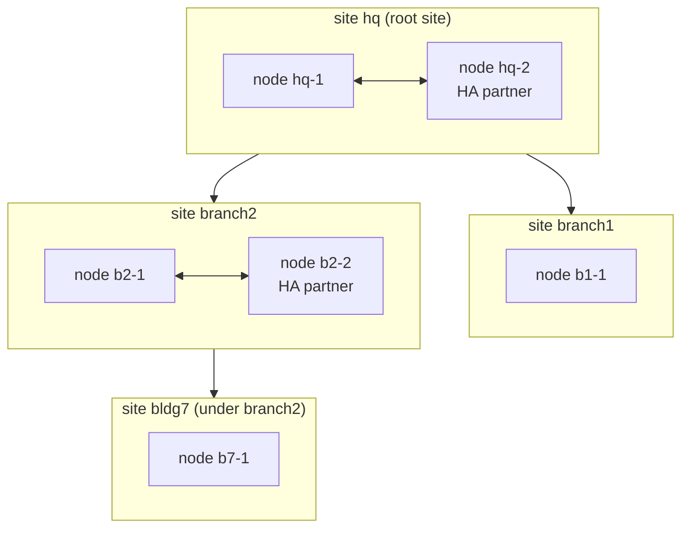

# Design: federation — sites, upstream/downstream, HA partners

Status: **design, not built** (branch `feature/federation`). Owner decisions
so far: a downstream can be a **branch site**, an **HA partner** within the
same site, and sites nest (**multi-level**); **upstream owns identity**.
Where an application has no HA of its own, **failover** (a standby an admin
promotes) is enough — no failover machinery is engineered at this stage.

## 1. Terms

| Term | Meaning |
|---|---|
| **fabric node** | One fabric install on one host (what exists today) |
| **site** | One location: one node, or two nodes that are **HA partners**. A site has a name (`hq`, `branch1`), its own LAN(s), its own DNS sub-zone and its own intermediate CA |
| **upstream / downstream** | Sites form a tree. The top site (the **root site**) owns identity and the root CA; each downstream site is attached to exactly one upstream site. A downstream can itself have downstreams (multi-level: region → site → building) |
| **HA partner** | The second node of a site. Partners are peers in the same site, never across sites |
| **join** | Attaching a new node to a site (as partner) or a new site to an upstream (as branch), once, with a one-time invitation |

## 2. Who owns what

**Upstream owns identity; each site owns its local network.**

| Data | Owner | Other sites get |
|---|---|---|
| People, groups (incl. the RBAC bundle groups), device roles | root site | a read-only copy |
| The root CA | root site | its certificate (trust anchor) |
| Permissions and bundles (the code's `rbac/`) | the software | identical everywhere |
| A site's devices (enrolled at that site) | that site | its upstream (and the root) get a read-only copy |
| A site's subnets, DHCP, switches (RADIUS clients), its DNS sub-zone, its intermediate CA | that site | upstream sees them (read-only; status and names) |
| A site's secrets (OpenBao) | that site | nothing — secrets never leave a site |

A compromised downstream therefore cannot change identity anywhere: it only
holds read-only copies of it, and upstream accepts nothing from it except
its own devices and its own zone.

## 3. What each service does

### 3.1 Within a site: HA partners

Native HA where the application has it; otherwise the partner keeps a
standby copy and an admin promotes it (`fabricctl site promote`, a
documented runbook — no virtual IPs, no automatic takeover at this stage).

| Service | HA partner mode | How clients reach it |
|---|---|---|
| **DNS (BIND)** | Native: one node is primary for the site's zones, the partner a secondary (NOTIFY + IXFR/AXFR, TSIG). Dynamic updates (DHCP names, ACME) go to the primary | DHCP hands out **both** nodes as resolvers: clients fail over by themselves |
| **DHCP (Kea 3.0)** | Native: Kea's HA hook (open source since 3.0), hot-standby, leases synchronised between the partners over HTTPS with mutual TLS (Step-CA certificates) | Both nodes serve the LAN; Kea decides which answers |
| **802.1X (FreeRADIUS)** | Native by design: both nodes answer, decisions come from the local directory copy (no shared state) | Switches list **both** nodes as RADIUS servers |
| **Directory (389-DS)** | Native: multi-supplier replication between the partners (both writable for the site's own data; identity stays read-only, see 3.2) | Each node's services use their local directory |
| **PKI (Step-CA)** | No shared state needed: **each node has its own intermediate CA** (signed by the site's CA); both issue | Either node |
| **Keycloak + Postgres** | Failover: Keycloak runs on the primary; the partner holds a Postgres **streaming replica** (read-only) and a stopped Keycloak | Promote by hand; DNS names (`sso.<site>…`) move with the promote |
| **OpenBao** | Failover: a two-node Raft cluster has no quorum after losing one node, so it would add nothing. The partner keeps **encrypted Raft snapshots** (every N minutes) and its own unlock method | Promote by hand (restore the latest snapshot) |
| **Web UI, fabric-agent, nginx** | Failover: run on the primary; installed but stopped on the partner | Promote by hand |

Why failover is acceptable here: DNS, DHCP and 802.1X — what the LAN
depends on minute to minute — keep working with no action when one node
dies. What needs a promote is the administration side (sign-in, secrets,
the web UI), which can wait for an admin.

### 3.2 Between sites: upstream/downstream

| Service | Federation |
|---|---|
| **Directory (389-DS)** | Two suffixes per node. The **organisation suffix** (people, groups, device roles) is supplied by the root site and replicated **down** read-only (a consumer at a leaf site, a read-only *hub* at a site that has downstreams). Each site's **site suffix** (`o=<site>`: its devices) is supplied by that site and replicated **up** read-only. Replication over TLS with certificate authentication. Changes wait in the supplier's changelog while a link is down |
| **Sign-in (Keycloak)** | Each site runs its own Keycloak, federating its **local** directory copy — sign-in works while the upstream is unreachable. Realm settings come from the same code (`keycloak_bootstrap`) everywhere. TOTP enrolment is per site (see decision F2) |
| **RBAC** | Bundle groups replicate with identity. A group applies **everywhere** (`network-operators`) or only to **one site** (`branch1-network-operators`); a site's Keycloak maps global groups and its own site's groups only (decision F4) |
| **PKI** | The root site's CA signs each downstream site's **intermediate** (path length set so multi-level works; optionally name-constrained to the site's DNS sub-zone, decision F6). Every site trusts the same root: a device certificate from any site is valid everywhere (EAP-TLS roaming, decision F3) |
| **DNS** | The root site owns `<domain>`. Each site serves a **delegated sub-zone** `<site>.<domain>` (NS + glue in the upstream zone), and its DHCP names under `dhcp.<site>.<domain>`. Each side is a **secondary** of the other's zones (TSIG), so names resolve both ways while the link is down |
| **DHCP** | Per site only: a site's subnets are its own; nothing is shared across sites. Upstream sees them read-only |
| **802.1X** | Per site: switches ask their own site; decisions come from the site's local directory copy. No RADIUS proxying between sites (roaming devices: decision F3) |
| **OpenBao** | Per site: every site keeps its own secrets and unlock methods; nothing replicates between sites. (Optional later: a site's encrypted export deposited upstream for disaster recovery) |
| **Images and packages** | Later (with D9/D21): a site pulls the validated image list and images through its upstream, which gives branches an offline path |

### 3.3 Offline behaviour of a branch

With the link to upstream down, a branch keeps: DNS for its own zone and
(from its secondary copy) the organisation's zone; DHCP; 802.1X; sign-in to
its own web UI; issuing certificates from its intermediate. It cannot
change identity (read-only) and does not see upstream changes until the
link returns (the changelog catches up). Its intermediate certificate must
outlive an outage: validity months, renewed through the upstream well
before expiry.

## 4. Joining

Assuming the right permissions: a new permission `federation:admin` (in the
admin bundle by default) is needed on the upstream to invite, and root on
the joining node.

1. **Invite** — on the upstream (CLI or web UI):
   `fabricctl federation invite branch2 --as site` (a new downstream site) or
   `fabricctl federation invite hq-2 --as partner` (an HA partner).
   Prints a **one-time invitation**: the upstream's federation address, the
   SHA-256 fingerprint of the root CA, and a single-use secret valid for one
   hour. Audited.
2. **Join** — on the new node, at install time:
   `fabricctl setup --join '<invitation>'` (a fresh install; see F1 for
   existing ones). The node connects to the upstream's federation endpoint
   (HTTPS, the server certificate checked against the pinned fingerprint),
   presents the secret and sends certificate requests.
3. **Upstream returns** (and records the site/node in its directory):
   - the root CA and a signed **intermediate** for the new site/node;
   - the organisation settings (domain, organisation suffix, site name);
   - replication credentials (a replication account per site, certificate-bound);
   - the TSIG key for zone transfers, and the NS delegation it added for `<site>.<domain>`;
   - for a partner: the site's settings (subnets, RADIUS clients, Kea HA peer), so both nodes serve the same LAN.
4. **Setup continues** as today, configured as a member: directory created
   as a consumer (plus its own site suffix), Keycloak federating it, DNS
   zones and secondaries, Kea (HA if partner), FreeRADIUS, its own OpenBao.
   Replication starts; `fabricctl doctor` checks the links.

**Leave**: `fabricctl federation leave` (downstream) or `… remove <site>`
(upstream): replication agreements removed, delegation removed, the site's
intermediate revoked (F7). The site keeps its copies and becomes standalone.

## 5. The federation endpoint

A new small API on each node, served by nginx on 443 (`federation.<site>.<domain>`)
and handled by fabric-agent: **mutual TLS** with node certificates from the
fabric CA chain (a node proves which site it is), plus the invitation secret
for the one join call. Routes: join, renew intermediate, status (for the
upstream's dashboard), and — later — site-local administration from the
upstream (F5). Firewall: peers are allowed to exactly the ports they need
(443 federation, 636 replication, 53 TCP zone transfers; within a site also
Kea HA and Postgres replication), like RADIUS clients today.

## 6. Multi-level

A downstream that has downstreams is a **hub**: its directory is a read-only
hub for the organisation suffix, its intermediate CA may sign intermediates
below it (path length), its sub-zone delegates further (`bldg7.branch2.<domain>`),
and it runs its own federation endpoint for its downstreams. Every site
still trusts the one root CA, and every site's devices flow up to the root.

## 7. What changes in fabric (when built)

| Area | Change |
|---|---|
| `vars.yaml` | `site_name`, `federation: {role: root|site|partner, upstream, peers}` |
| 389-DS | the site suffix; replication agreements, changelog, TLS replication binds; consumer/hub modes |
| Keycloak | group-to-bundle mapping aware of site-scoped groups |
| RBAC | `federation:read`, `federation:admin` |
| PKI / setup | subordinate intermediate from the upstream at join (the BYOC path, automated); per-node intermediates for partners |
| DNS | sub-zone generation and delegation, secondary zones, TSIG for transfers |
| Kea | the HA hook and peer configuration for partners |
| Keycloak/Postgres, OpenBao | standby replica / snapshots on partners; `fabricctl site promote` runbook |
| fabric-agent, nginx | the federation endpoint (mTLS) |
| Setup | `--join`; `fabricctl federation invite|join|leave|status` |
| Web UI | a Federation tab: sites, nodes, link health, invitations |
| Tests | a two-node and a three-site sandbox (docker networks as sites) |

## 8. Phases

| Phase | What | Depends on |
|---|---|---|
| F1 | Trust and names: invitation/join, subordinate intermediates, delegated sub-zones with secondaries, the federation endpoint, `federation status` | — |
| F2 | Identity: organisation suffix down, site suffix up, site-scoped groups, per-site Keycloak | F1 |
| F3 | HA partners: BIND secondary, Kea HA, 389-DS multi-supplier, per-node intermediates, standby Postgres and OpenBao snapshots, the promote runbook | F1, F2 |
| F4 | Multi-level hubs; upstream dashboard; image/package mirroring through the upstream; optional delegated administration | F2 |

## 9. Decisions for the owner

| # | Question | Proposal |
|---|---|---|
| F1 | Can an **existing** install join, or only a fresh one? | Fresh (or an empty directory) at first: merging two directories' people is a migration project of its own |
| F2 | **TOTP** at branches: enrolled per site, or sign in through the upstream's Keycloak (identity brokering)? | Per site first (works offline); brokering to the upstream as an option later, with the local sign-in as fallback |
| F3 | **Roaming devices** (a laptop from branch1 at branch2): replicate every site's devices to every site (read-only), or only upward? | Every site's devices to every site, read-only: EAP-TLS then works anywhere with no RADIUS proxying |
| F4 | **Site-scoped admin groups**: naming and who may create them | `<site>-<bundle>` groups, created in the root site's directory; a site's Keycloak honours global groups plus its own |
| F5 | May upstream admins manage a site's **local** items (subnets, switches) through the federation API, or only the site's own admins? | Site admins only in F1–F3; delegated administration from upstream in F4 behind `federation:admin` |
| F6 | **Name-constrain** each site's intermediate to `<site>.<domain>`? | Yes for DNS names; people and device certificates use non-DNS names, so check the constraint set against them before deciding |
| F7 | **Revocation** of a removed site's intermediate | A CRL from the root site's CA, published on `certs.<domain>` and checked by every site's FreeRADIUS and nginx (today there is no CRL: fabric relies on unlinking devices) |
| F8 | HA **promote**: by hand only (this design), or automatic later? | By hand now (owner: no failover engineering at this stage) |

## References

- 389 Directory Server: multi-supplier, hub and consumer replication; fractional and certificate-based replication.
- Kea 3.0: the high-availability hook (hot-standby, load-balancing) and TLS for the HA channel.
- BIND 9.20: primaries/secondaries, NOTIFY, TSIG-signed zone transfers, delegation.
- Step-CA: intermediate CAs signed by an external root ("bring your own CA"), path length.
- Keycloak: LDAP user federation; identity brokering (OIDC).
- OpenBao: Raft storage, snapshots (`bao operator raft snapshot save/restore`).
- PostgreSQL: streaming replication and promotion.
