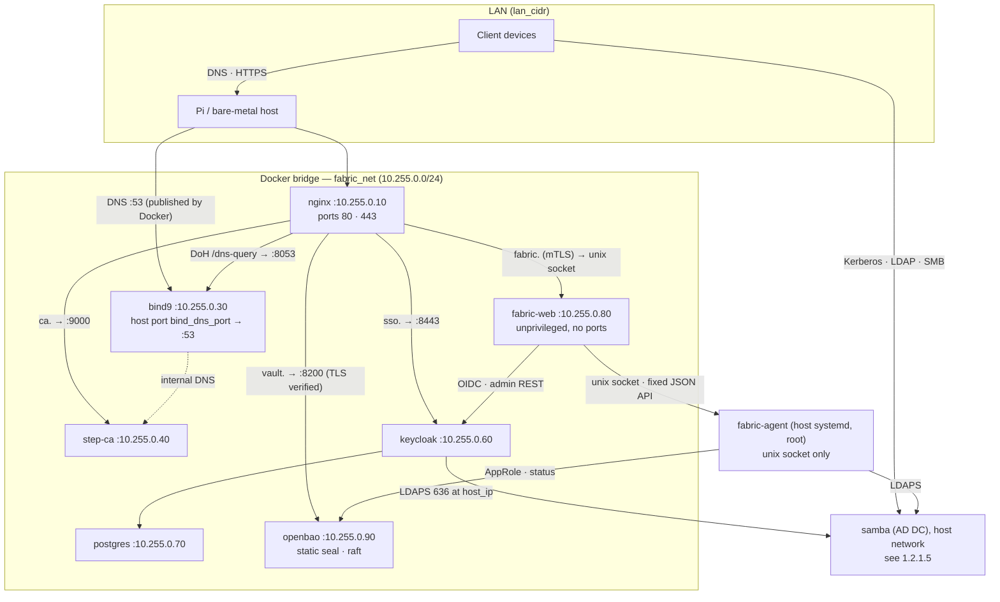
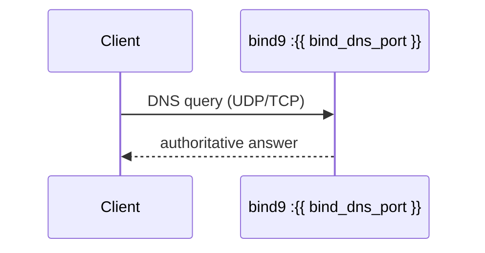
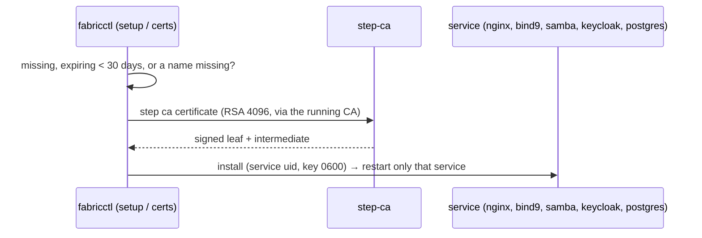
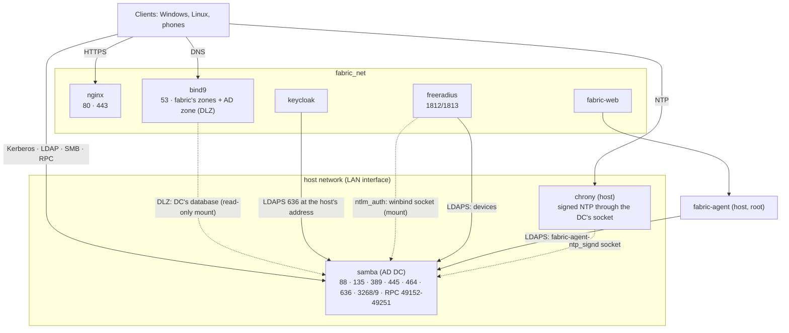

# 1.2.1 System topology and request flows

Topics:
- 1.2.1.1 Overview
- 1.2.1.2 System Topology
- 1.2.1.3 Request flow — DNS
- 1.2.1.4 Request flow — TLS certificate issuance
- 1.2.1.5 Topology with Samba AD

## 1.2.1.1 Overview

This document provides an in-depth breakdown of the `fabric` infrastructure, covering the request flows, the underlying directory structures (both source and target), and technical references for PKI, DNS, and Jinja2 rendering.

## 1.2.1.2 System Topology

Optional services: `kea-dhcp4` (host network, DHCP on the LAN) with `kea-ddns` (10.255.0.97, dynamic updates into BIND9), `freeradius` (10.255.0.98, UDP 1812/1813 on `host_ip`, asks the DC over LDAPS and winbind) and `fluentbit` (10.255.0.95, reads the host journal and OpenBao's audit log).

---

## 1.2.1.3 Request flow — DNS

---

## 1.2.1.4 Request flow — TLS certificate issuance

---

## 1.2.1.5 Topology with Samba AD

The design of [1.6.3](1.6.3-samba-directory.md) and [1.6.5](1.6.5-samba-dc.md),
approved by the owner 2026-10-04 and built in steps S1–S7 (2026-10-05). The DC side of 1.2.1.2 in detail: the DC
runs in the host network on the LAN interface (2.1.6.18); nginx passes no LDAP through; 389-DS (`dirsrv`) went in S7.

