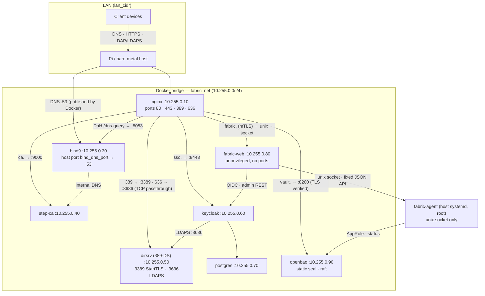
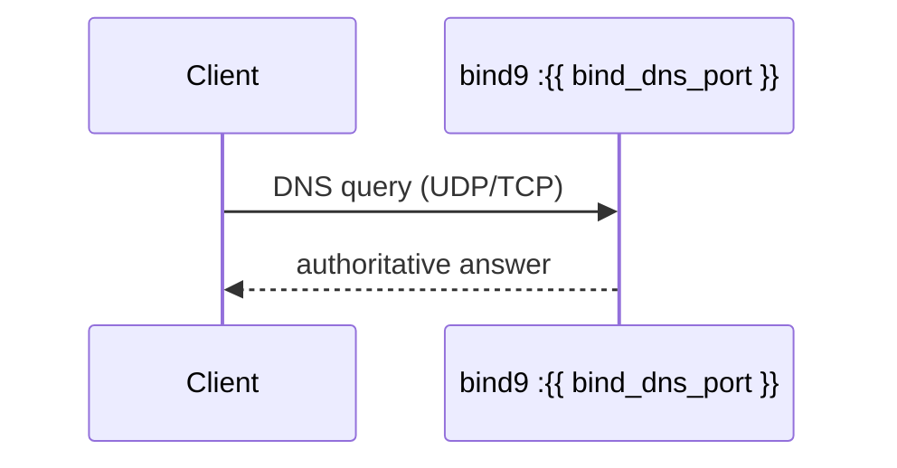
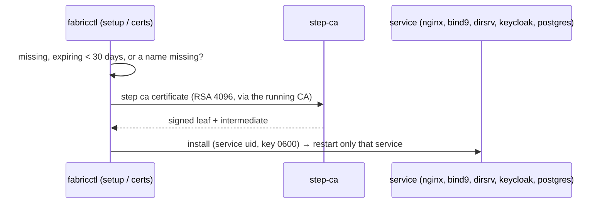

# 1.3.1 System topology and request flows

Topics:
- 1.3.1.1 Overview
- 1.3.1.2 System Topology
- 1.3.1.3 Request flow — DNS
- 1.3.1.4 Request flow — TLS certificate issuance

## 1.3.1.1 Overview

This document provides an in-depth breakdown of the `fabric` infrastructure, covering the request flows, the underlying directory structures (both source and target), and technical references for PKI, DNS, and Jinja2 rendering.

## 1.3.1.2 System Topology

Optional services: `kea-dhcp4` (host network, DHCP on the LAN) with `kea-ddns` (10.255.0.97, dynamic updates into BIND9), `freeradius` (10.255.0.98, UDP 1812/1813 on `host_ip`, asks 389-DS over LDAPS) and `fluentbit` (10.255.0.95, reads the host journal and OpenBao's audit log).

---

## 1.3.1.3 Request flow — DNS

---

## 1.3.1.4 Request flow — TLS certificate issuance

---
