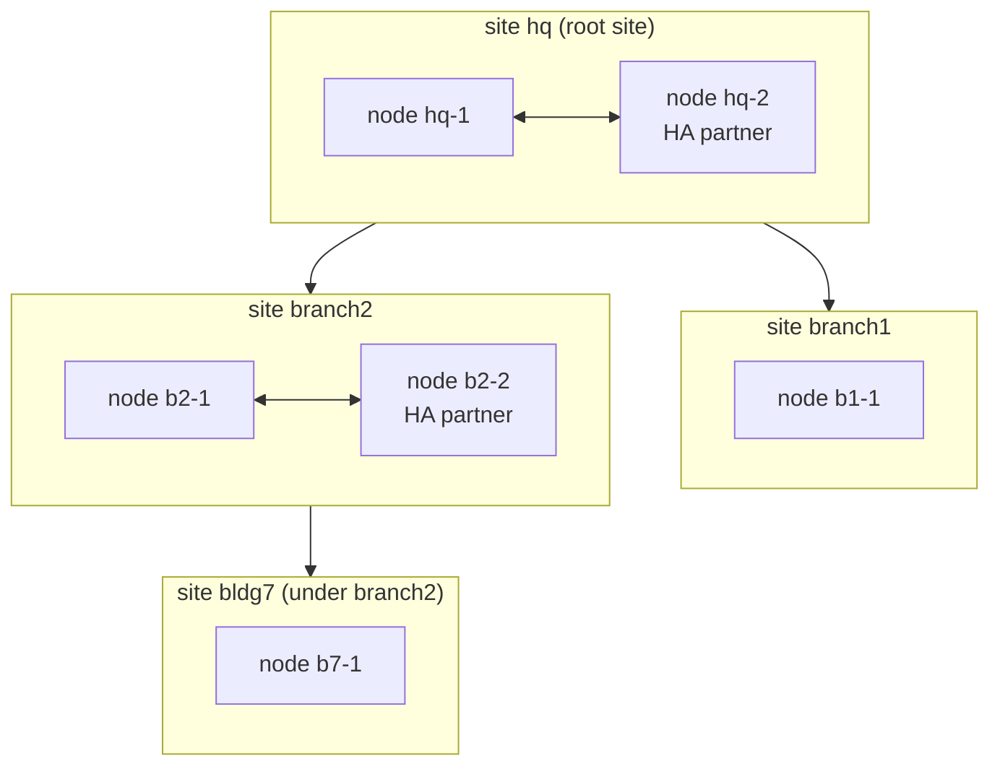

# 1.8.1 Sites, terms and ownership

Topics:
- 1.8.1.1 Status
- 1.8.1.2 Terms
- 1.8.1.3 Who owns what

## 1.8.1.1 Status

Status: **being built** (branch `feature/federation`; [1.8.7.2](1.8.7-milestones.md#1872-building-f1--f2-in-progress)). Owner decisions
so far: a downstream can be a **branch site** or an **HA partner** within the
same site; sites attach to the root **flat** (the default), **through a
relay node**, or **nested** under another site ([1.8.5.1](1.8.5-attachment.md#1851-attachment-flat-through-a-node-or-nested)); every site keeps
working when its upstream goes away ([1.8.3.3](1.8.3-between-sites.md#1833-offline-behaviour-of-a-branch-and-of-every-site-if-the-root-goes-away)); **upstream owns identity**.
Where an application has no HA of its own, **failover** (a standby an admin
promotes) is enough — no failover machinery is engineered at this stage.

## 1.8.1.2 Terms

| Term | Meaning |
|---|---|
| **fabric node** | One fabric install on one host (what exists today) |
| **site** | One location: one node, or two nodes that are **HA partners**. A site has a name (`hq`, `branch1`), its own LAN(s), its own DNS sub-zone and its own intermediate CA |
| **upstream / downstream** | Sites form a tree. The top site (the **root site**) owns identity and the root CA; each downstream site is attached to exactly one upstream site: the root (**flat**, the default), the root through a relay **node**, or another site that owns it (**nested**, opt-in) — see [1.8.5.1](1.8.5-attachment.md#1851-attachment-flat-through-a-node-or-nested) |
| **HA partner** | The second node of a site. Partners are peers in the same site, never across sites |
| **join** | Attaching a new node to a site (as partner) or a new site to an upstream (as branch), once, with a one-time invitation |

## 1.8.1.3 Who owns what

**Upstream owns identity; each site owns its local network.**

| Data | Owner | Other sites get |
|---|---|---|
| People, groups (incl. the RBAC bundle groups), device roles | root site | a read-only copy |
| The root CA | root site | its certificate (trust anchor) |
| Permissions and bundles (the code's `rbac/`) | the software | identical everywhere |
| A site's devices (enrolled at that site) | that site | its upstream (and the root) get a read-only copy |
| A site's subnets, DHCP, switches (RADIUS clients), its DNS sub-zone, its intermediate CA | that site | upstream sees them (read-only; status and names) |
| A site's secrets (OpenBao) | that site | nothing — secrets never leave a site |

A compromised downstream therefore cannot change identity anywhere: it only
holds read-only copies of it, and upstream accepts nothing from it except
its own devices and its own zone.
