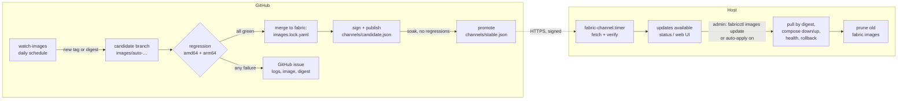

# 2.6.2 Image updates: validation and the host side

Topics:
- 2.6.2.1 Status
- 2.6.2.2 Goal
- 2.6.2.3 Principles
- 2.6.2.4 Overview
- 2.6.2.5 The lock file (`images.lock.yaml`, in git)
- 2.6.2.6 CI: watch, test, publish
- 2.6.2.7 The host side
- 2.6.2.8 Settings (vars.yaml)
- 2.6.2.9 Build order
- 2.6.2.10 Decisions (D21)

## 2.6.2.1 Status


Status: **partly built.** Build steps 1–2 ([2.6.2.9](2.6.2-image-updates.md#2629-build-order)) are built: everything pinned by digest in
`fabricctl/images.lock.yaml` and `fabricctl images status / update / rollback / prune` on the
host. Not built: the CI workflows (watcher, regression, publishing, issues), the signed
channel and its fetch timer, offline export/import, automatic applying, the web UI Updates
panel and every setting in [2.6.2.8](2.6.2-image-updates.md#2628-settings-varsyaml) except `image_prune`. Extends [2.6.1.1](2.6.1-image-channels.md#2611-image-channels-tested-versions-decoupled-from-releases)
and decisions D9, D10, D13. Decision D21 below.

## 2.6.2.2 Goal

Upstream images (nginx, Keycloak, Postgres, BIND, Step-CA, OpenBao, Debian
for the local builds, later Kea, FreeRADIUS, Fluent Bit) change all the
time, including security fixes. fabric must:

1. **Notice** new upstream versions automatically.
2. **Prove** them with the same real-container regression suites we run by
   hand, on **amd64 and arm64**, including an upgrade of an existing
   install.
3. **Pass** → commit the new pins to git and publish them as the next
   *validated list*. **Fail** → open a GitHub issue with the evidence, and
   keep the current pins.
4. On every host: **fetch the validated list automatically** (unless the
   host is in offline mode) and show what could be updated. **Nothing
   running changes** until the admin applies it, or has explicitly turned
   on automatic applying.
5. **Clean up** old fabric images automatically, never anything else.

Non-goals: updating the `fabricctl` package itself (that is the APT repo,
D7), updating Docker or the host OS.

## 2.6.2.3 Principles

- **Pinned by digest, always.** Every image fabric runs is
  `repo:tag@sha256:<index digest>`; the multi-arch index digest covers
  amd64 and arm64. `:latest` or a bare tag never runs. An upstream push can
  never change what a host runs.
- **One source of truth in git**: `fabricctl/images.lock.yaml` (ships with fabric). The validated list
  hosts fetch is generated from it and signed.
- **Nothing untested ships**: a digest reaches the list only after the full
  suites passed on both architectures with exactly that digest.
- **Fetching is not applying.** Hosts download a small signed file; they
  pull images and recreate containers only when told to.
- **Every step can be reproduced by hand**: the workflows call the same
  scripts a developer runs (`tests/run-all.sh`, `fabricctl images …`).

## 2.6.2.4 Overview



## 2.6.2.5 The lock file (`images.lock.yaml`, in git)

```yaml
# Written by the watch-images workflow; reviewed like code.
images:
  keycloak:
    repo: quay.io/keycloak/keycloak
    track: "26.*"                 # which new tags are candidates (see policy)
    tag: "26.4.2"
    digest: "sha256:…"            # multi-arch index digest
    platforms: [linux/amd64, linux/arm64]
    suites: [keycloak, webui, sandbox]   # which suites exercise it
    policy: auto                   # auto | manual
  postgres:
    repo: docker.io/library/postgres
    track: "17.*"
    tag: "17.6"
    digest: "sha256:…"
    platforms: [linux/amd64, linux/arm64]
    suites: [keycloak, sandbox]
    policy: auto
  debian:                          # base of the locally built images (dirsrv, webui, …)
    repo: docker.io/library/debian
    track: "trixie-slim"           # same tag, new digest = a rebuilt base (security fixes)
    tag: "trixie-slim"
    digest: "sha256:…"
    suites: [dirsrv, webui, hardening, sandbox]
    policy: auto
```

- **track** is the update policy per image:
  - a tag pattern within one major/minor (`26.*`, `17.*`): patch and minor
    releases are candidates automatically;
  - a floating tag (`trixie-slim`, `stable-alpine`): a changed digest is a
    candidate (upstream rebuilt it, usually for CVEs);
  - a new **major** is never automatic: the watcher opens an issue
    ("Keycloak 27 available") and a person changes `track`.
- **policy: manual** freezes an image (known upstream problem): the watcher
  reports but proposes nothing.
- `fabricctl/jinja/vars.yaml.j2` defaults and the build files are **generated
  from this file** (a render test fails if any image is unpinned or differs
  from the lock). This file replaces today's hand-written `image_*` defaults.

**Built** (`fabricctl/images.lock.yaml`): each entry has `var` (the vars key
it sets, e.g. `image_keycloak`), `repo`, `tag`, `digest`, `track` and
`policy`; `platforms` and `suites` from the sketch above are not there yet.
A second section, `packages:`, pins packages installed into fabric's own
images from an upstream apt repository (Kea 3.0: exact version, repository,
signing-key fingerprint; D22). `vars.yaml.j2` takes the `image_*` defaults
from the lock and the local builds get the pinned ref as `BASE_IMAGE`;
`tests/render.py` fails on anything unpinned, on a default that differs from
the lock and on a Dockerfile not `FROM ${BASE_IMAGE}`.

## 2.6.2.6 CI: watch, test, publish

> **Not built.** The only workflow is `.github/workflows/package.yml`
> (builds the `.deb`); the suites run by hand (`sudo tests/run-all.sh`).

All workflows live in `.github/workflows/`, use actions pinned by commit
SHA, and least-privilege tokens.

### 2.6.2.6.1 `watch-images.yml` (daily, and on demand)

1. For each image in the lock: list tags (`regctl` / `crane`), pick the
   newest tag matching `track`, resolve its **index digest**, check it
   publishes both `linux/amd64` and `linux/arm64`.
2. Anything new (tag or digest) → a candidate. An image missing an
   architecture is not a candidate: it gets an issue instead.
3. Skip digests that already failed (an open issue labelled with that
   digest exists) until upstream publishes something newer or the issue is
   closed.
4. Write the candidate `images.lock.yaml` to a branch
   `images/auto-<date>` and dispatch the regression workflow on it.
5. Optional verification when upstream provides it: cosign signatures /
   provenance (e.g. images signed with Sigstore) — a failed signature check
   fails the candidate.

**Batching and blame.** Candidates are tested together (one run per day,
cheapest). If the batch fails, the workflow re-runs the failed suites once
per changed image (only that image moved) to name the culprit, so the
issue points at one image and the others can still go through.

### 2.6.2.6.2 `regression.yml` (on the candidate branch)

Matrix: `ubuntu-24.04` (amd64) and `ubuntu-24.04-arm` (arm64) runners; an
optional self-hosted **Raspberry Pi 4 (4 GB)** runner for the reference
hardware (memory budget, timings).

| Stage | What | Fails the candidate when |
|---|---|---|
| Static | render with the candidate lock; every image pinned; both platforms present | anything unpinned or single-arch |
| Suites | `tests/run-all.sh` (render, nginx, zone, webui, pki, openbao, dirsrv, keycloak, hardening) | any FAIL |
| Full install | `tests/run-all.sh sandbox` from the `.deb` with the candidate lock | any FAIL |
| **Upgrade** | install with the **current** lock, create data (DNS records, devices, certs, secrets, a Keycloak user with TOTP), then apply the candidate with `fabricctl images update --all`; run doctor and the data checks | lost data, a service that does not come back, rollback triggered |
| Hardening | containers still non-root, no capabilities, read-only root, memory limits honoured under the suites | any regression |
| Budget (Pi runner) | total RSS of the stack under the 4 GB budget (design [1.3.8.1](../volume_1_systems_and_services/1.3.8-targets-and-hardening.md#1381-targets-and-hardening)) | over budget |
| Scan (report) | Trivy scan of each candidate image | **not** a failure by itself; new criticals with a fix available are listed in the PR / issue |

Runs time out (sandbox ~20 min per arch). Logs and `$FABRIC_TEST_OUT` are
uploaded as artifacts, kept 30 days.

### 2.6.2.6.3 Pass: commit to git

- The bot opens a PR from `images/auto-<date>` to `fabric`
  ("images: keycloak 26.4.1 → 26.4.2, debian trixie-slim rebuilt") with the
  test summary per architecture and the scan report.
- Branch protection requires the regression checks; with all green the PR
  is **auto-merged** (policy `auto`). A person can always hold it.
- Merge → `publish-channel.yml` renders `channels/candidate.json` from the
  lock, signs it (Ed25519, key only in the protected `channel-signing`
  environment), and commits both to the `gh-pages` branch
  (`/channels/…`), which GitHub Pages serves.
- **Promotion**: after the soak period (D13: 7 days) with no regression
  issue opened against that serial, a scheduled job copies it to
  `channels/stable.json` with a higher serial, signed. Hosts follow
  `stable` by default; test hosts can follow `candidate`.

### 2.6.2.6.4 Fail: GitHub issue

One issue per failing image + digest, deduplicated by labels
`image:<name>` and `digest:<short>`; a repeat failure comments on the open
issue instead of opening another.

```
Title: images: keycloak 26.4.2 fails regression (arm64, upgrade)
Labels: image-update, image:keycloak, digest:3f9c1a…, arch:arm64
Body:
  candidate  quay.io/keycloak/keycloak:26.4.2@sha256:3f9c1a…
  current    quay.io/keycloak/keycloak:26.4.1@sha256:…
  failed     arm64 · upgrade stage · "admin: TOTP still works after update"
  first log lines of the failing check
  links: workflow run, artifacts (logs), upstream release notes
  the current pin stays; this digest is skipped until closed or superseded
```

Assignment/notification uses the repo's normal GitHub settings.

### 2.6.2.6.5 Trust and safety

- The channel signing key never leaves the protected environment; only
  `publish-channel.yml` on `fabric` can use it. Hosts ship the public key.
- The watcher treats registry data as untrusted input: tag names are
  validated against a strict pattern before they reach a branch name,
  file or shell.
- `requires_fabric` in the channel stops old fabric versions from getting
  images that need newer fabric code.
- **Recall**: a bad image that slipped through is fixed by publishing a new
  serial with the previous digest (hosts never accept a lower serial, so
  "going back" is always a new, higher serial).

## 2.6.2.7 The host side

### 2.6.2.7.1 Fetch the validated list (automatic, unless offline)

> **Not built.** Today the validated list is the `images.lock.yaml` of the
> installed fabric: a host learns of new validated images by installing a
> newer `fabricctl` package and re-running `sudo fabricctl setup` (which
> keeps the images the host runs), then `fabricctl images status` shows the
> difference. No timer, `images fetch`, `images export/import` or
> `offline_mode` setting exists.

`fabric-channel.timer` (daily, randomised delay) runs
`fabricctl images fetch`:

1. Download `stable.json` + signature over HTTPS (`image_channel_url`,
   default GitHub Pages; a local mirror works the same way).
2. Verify: signature (the public key shipped with fabric), `serial` higher
   than the stored one (no rollback or freeze attacks), not expired,
   `requires_fabric` met. Any failure → keep the previous list, record why.
3. Store it (`/etc/fabric/images/channel.json`, root 0644) and compare with
   what each container runs now.
4. Report: `fabricctl status` and the web UI Overview show
   "updates available: keycloak 26.4.1 → 26.4.2 (validated 2026-10-12)";
   the audit log and Fluent Bit (if installed) get one line.

**Nothing is pulled or restarted by fetching.** Optional
`image_prefetch: true` downloads the validated images in the background (no
restart) so applying later is fast; off by default to spare bandwidth.

**Offline mode** (`offline_mode: true`, asked during setup): the timer is
not installed and fabric never contacts the internet. Updates arrive by
hand: `fabricctl images import <bundle>` (signed list + image tarballs,
exported on any online machine with `fabricctl images export`), verified
exactly like a download.

### 2.6.2.7.2 Apply (by the admin, or automatically if enabled)

> **Built:** the five commands below except that `images status` compares
> against the installed lock, not a fetched list. As built, `images update`
> moves one image var at a time, in the order of
> `fabriclib/images/constants.py`: it pulls by digest, re-renders and
> redeploys the configuration (local images rebuild on the new base), then
> restarts each service using that image through its systemd unit and waits
> for its container healthcheck (no extra service-specific checks). Services
> that share a base (`image_debian`: bind9, dirsrv, kea, freeradius and the
> web UI) move together. On failure that var is rolled back the same way,
> the run stops and the error is audited. Image vars the admin set in
> `vars.yaml` are held unless `--force`. The previous ref of each var is
> kept in `/etc/fabric/images/state.json` for `images rollback`. There is no
> Updates panel or agent route yet, and no automatic applying.

| Command | What |
|---|---|
| `fabricctl images status` | Each service: running digest, validated digest, update available? |
| `fabricctl images update <service…>` | Update those services |
| `fabricctl images update --all` | Everything with an update, in dependency order |
| `fabricctl images rollback <service>` | Back to the previous digest (kept locally) |
| `fabricctl images prune` | Clean up now (see 6.3) |

Per service, one at a time (dependency order: postgres before keycloak,
bind9 and step-ca first, nginx and webui last):

1. `docker pull repo:tag@sha256:…` (or rebuild the local image on the new
   Debian digest). Verify the pulled digest.
2. Render the service's compose file with the new pin (vars from the list).
3. **`docker compose down` then `up`** for that service through its systemd
   unit (so hardening, limits and the unlock condition still apply).
4. Wait for its healthcheck (and service-specific checks: DNS answers,
   OpenBao unsealed, Keycloak login page, LDAP bind).
5. Healthy → next service. Unhealthy → render the previous pin, down/up
   again, stop the run, report the failure (audit log, status, web UI). The
   list stays "update available" with the error.

The web UI gets an **Updates** panel (Overview): what is available, release
notes links, an "Update" button per service and "Update all", all as
fabric-agent calls (RBAC: `system:admin`, step-up sign-in).

**Automatic applying** is **off by default**. With
`image_auto_apply: true` the timer applies validated updates itself inside
a maintenance window (`image_update_window: "03:00-05:00"`), with the same
one-at-a-time, health-gated, auto-rollback procedure; optional
`image_auto_apply_only: [nginx, bind9]` to limit it to chosen services.

### 2.6.2.7.3 Automatic cleanup of old images

> **Built:** `fabricctl images prune`, also run after every successful
> `images update` unless `image_prune: false`; no weekly run (no timer).
> It keeps every image pinned in `vars.yaml`, the rollback image and any
> image a container uses, removes other images of the lock's repositories,
> then prunes dangling local builds (label `org.fabric.base`).

After every successful update (and weekly from the timer):

- Keep: every digest a fabric compose file references now, **and the
  previous digest of each service** (for `images rollback`).
- Remove: other images of the **repos listed in the lock** (older fabric
  pins) and superseded `fabric/*:local` builds.
- Never touch images of other repos, images any container (fabric or not)
  uses, or anything with a non-fabric label. No `docker image prune -a`.
- Report what was freed. `image_prune: false` turns it off.

## 2.6.2.8 Settings (vars.yaml)

Only `image_prune` exists today (plus `image_pins`, written by setup: the
`image_*` keys the admin set, which `images update` leaves alone).

| Setting | Default | Meaning |
|---|---|---|
| `offline_mode` | `false` | Never contact the internet; updates only by `images import` |
| `image_channel` | `stable` | `stable` or `candidate` |
| `image_channel_url` | GitHub Pages | Or a local mirror |
| `image_prefetch` | `false` | Download validated images ahead of time (no restart) |
| `image_auto_apply` | `false` | Apply validated updates automatically in the window |
| `image_update_window` | `03:00-05:00` | When automatic applying may run |
| `image_auto_apply_only` | `[]` (all) | Limit automatic applying to these services |
| `image_prune` | `true` | Clean up old fabric images after updates and weekly |

## 2.6.2.9 Build order

1. **Pin everything now**: `images.lock.yaml` with today's versions,
   generated defaults, render test that refuses unpinned images (the step
   agreed before this design).
2. Host: `fabricctl images status / update / rollback / prune`, driven by
   the lock (no channel yet); sandbox upgrade test.
3. CI: `regression.yml` on amd64 + arm64 for PRs that touch the lock.
4. CI: `watch-images.yml` + issues + auto-merge.
5. Channel: signing, `gh-pages` publishing, promotion; host
   `fabric-channel.timer` fetch + verify; offline export/import.
6. Web UI Updates panel; automatic applying; Pi self-hosted runner.
7. **Build fabric's own images in CI** (bind9, dirsrv, kea, webui and the
   thin layers over step-ca / keycloak) as part of the regression run,
   publish them multi-arch to fabric's registry (e.g. ghcr.io) and pin them
   by digest in the list like any other image. Hosts then pull byte-identical,
   tested images instead of building them from distribution packages at
   setup (no mirror needed, faster on a Pi, offline = import the images).

**Precondition for step 5:** rename the GitHub repository (to `open-fabric`, decision D24)
*before* the validated list (or the APT repo) is published on GitHub Pages:
GitHub redirects git and web URLs after a rename, but not Pages URLs, and
hosts will have the list's URL built in.

**Built (steps 1–2):** everything pinned by digest in
`fabricctl/images.lock.yaml` (render test refuses anything else), setup keeps
running images across upgrades, `fabricctl images status / update /
rollback / prune` (sandbox: update, setup keeps it, rollback, a broken
image rolled back by itself, prune keeps the rollback image).

## 2.6.2.10 Decisions (D21)

| # | Question | Proposal |
|---|---|---|
| D21a | Who applies updates | The admin (`fabricctl images update`, web UI); automatic only with `image_auto_apply: true` |
| D21b | Fetching the list | Automatic daily unless `offline_mode: true` |
| D21c | Old images | Pruned automatically, fabric's own only, the previous digest kept for rollback |
| D21d | Auto-merge of passing candidates | Yes for patch/minor within `track`; majors need a person |
| D21e | Soak before `stable` | 7 days (D13) |
| D21f | arm64 runners | GitHub-hosted `ubuntu-24.04-arm`; a self-hosted Pi 4 later for the budget check |
| D21g | CVE scan | Reported, not blocking (a known-vulnerable current image is not better than a tested new one) |
