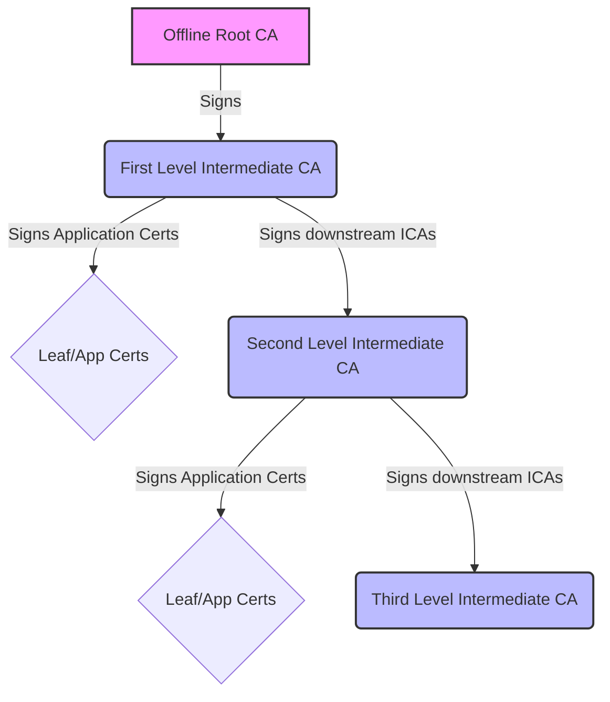
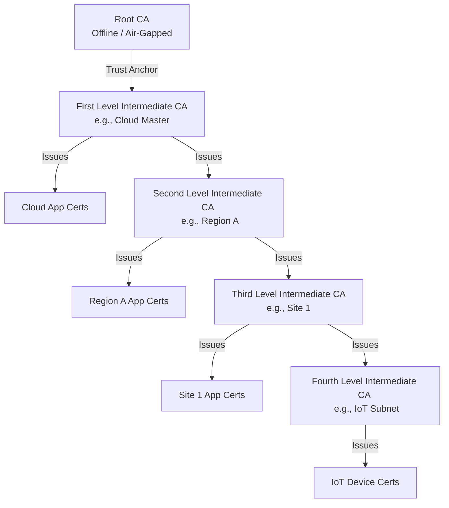

# 3.5.2 Subordinate CAs and nested layouts

Topics:
- 3.5.2.1 Overview
- 3.5.2.2 Intended Architectural Workflow
- 3.5.2.3 Example Scenario (Deep Nesting)
- 3.5.2.4 Step 1: Mint the Subordinate CA on the First Level Host
- 3.5.2.5 Hardware Keys: Signing a CSR
- 3.5.2.6 Step 2: Retrieve the Root CA
- 3.5.2.7 Step 3: Transfer Files to the Subordinate Host
- 3.5.2.8 Step 4: Configure the Subordinate Deployment

## 3.5.2.1 Overview


The `fabric` infrastructure natively supports multi-tier, nested PKI deployments. This allows you to build a comprehensive hierarchy where a "First Level Intermediate CA" can issue both local application certificates AND sign further Subordinate ICAs for segmented environments (Second Level Intermediate CAs, Third Level, etc.).

### 3.5.2.1.1 Are Subordinate CAs minted from the Root or the ICA?
When you use `fabric`'s `fabricctl` to mint a subordinate CA, it is **minted and signed by the Intermediate CA**, not the Root CA. The `step-ca` daemon running on your host operates exclusively using the Intermediate CA's private key. The Root CA remains isolated and is not used for day-to-day operations.



Because all intermediate CAs in this chain are ultimately derived from the same Root CA, any device that trusts the Root CA will automatically trust application certificates issued by *any* ICA in the network, establishing seamless mutual trust across all levels.

## 3.5.2.2 Intended Architectural Workflow

A highly secure, best-practice deployment looks like this:
1. **Offline Root CA**: A highly secured, offline machine generates the Root CA and signs the certificate for your **First Level Intermediate CA**. The Root CA then goes offline to protect its private key.
2. **First Level Intermediate CA**: Installed via BYOC (Bring Your Own Certs) on your master infrastructure. This ICA performs two roles:
   - Signs application/leaf certificates for its local network.
   - Generates and signs certificates for downstream **Second Level Intermediate CAs**.
3. **Second Level Intermediate CAs**: Segmented infrastructure deployments that operate independently to sign application/leaf certificates for their respective networks, and potentially sign **Third Level Intermediate CAs**.

## 3.5.2.3 Example Scenario (Deep Nesting)

The trust model allows chains of any depth. Here is an example of a 4-level deep architecture (for setting up a deeper level with fabric, see the note in [Step 4](#3528-step-4-configure-the-subordinate-deployment)).


As long as the client devices have the **Root CA** installed, they will implicitly trust `App1`, `App2`, `App3`, and `App4` seamlessly.

## 3.5.2.4 Step 1: Mint the Subordinate CA on the First Level Host

Log in to the host machine running your First Level infrastructure and mint a new intermediate CA certificate. The **path length** is given on the command line: how many further levels of ICAs the new CA may issue. For a Second Level ICA that needs to issue Third Level ICAs, give `1` or more; for one that only issues leaf certificates, `0` (the default when no number follows).

```bash
sudo mkdir -p /root/sub-certs
sudo fabricctl --mint-certs --intermediate-ca 1
```

**Interactive Prompts:**
1. **Common Name**: letters, digits, `.`, `_`, `@`, `*` and `-` only (no spaces), e.g. `region-a.ica.internal`.
2. **Validity in days** (default 365).
3. **Output directory**: an existing folder, e.g. `/root/sub-certs` (default: the home of the account that ran `sudo`).
4. **Key type** and **key size** (defaults RSA 4096; `--kty` / `--size` change the defaults).

After a review and `y`, the entry is added to `extra_certs` in `vars.yaml` and two files are written to the output directory, named after the Common Name with `.`, `/` and spaces turned into `-`:
- `region-a-ica-internal.crt` (the intermediate CA certificate, followed by the First Level chain)
- `region-a-ica-internal.key` (its private key, unencrypted, `0600`)

Setup's `certs` step and `fabricctl certs` keep every `extra_certs` entry issued: if these files are moved away, or the certificate is within 30 days of expiry, a new certificate **with a new key** is minted into the same folder (and setup fails if the folder no longer exists). Once you have copied the files to the subordinate host, remove the entry from `extra_certs` in `/opt/fabric/config/vars.yaml` by hand (the interactive menu treats `extra_certs` as immutable).

## 3.5.2.5 Hardware Keys: Signing a CSR

If you are using a **Hardware Security Module (HSM)** or a **YubiKey** to store the private key for your Second Level Intermediate CA, you will generate a Certificate Signing Request (CSR) locally on the hardware instead of letting `fabricctl` generate the key for you.

Once you have your CSR file (e.g., `hardware-key.csr`), you can use the First Level infrastructure's `step-ca` backend to sign it.

1. Transfer your `hardware-key.csr` to the First Level host.
2. Copy it into the step-ca volume (`/opt/stepca/data` is `/home/step` inside the container; `artifacts/` is its scratch folder, created by fabric when it first mints a certificate):
   ```bash
   sudo cp hardware-key.csr /opt/stepca/data/artifacts/
   sudo chmod 0644 /opt/stepca/data/artifacts/hardware-key.csr
   ```
3. Use the `step certificate sign` command directly inside the container to sign the CSR using the First Level ICA's private key:
   ```bash
   sudo docker exec step-ca step certificate sign \
       /home/step/artifacts/hardware-key.csr \
       /home/step/certs/intermediate_ca.crt \
       /home/step/secrets/intermediate_ca_key \
       --profile intermediate-ca \
       --not-after 87600h \
       --password-file /home/step/secrets/password \
       > second_level_ica.crt
   ```
4. You now have a `second_level_ica.crt` that is cryptographically signed by the First Level ICA, while the private key never left your hardware device!

## 3.5.2.6 Step 2: Retrieve the Root CA

You will also need the Root CA certificate. On the First Level host it is `/opt/stepca/data/certs/root_ca.crt`; it is also published on the First Level CA page (`certs.<domain>`, here `top.internal`), plain HTTP too:

```bash
curl -o root_ca.crt http://certs.top.internal/root-ca.crt
openssl x509 -in root_ca.crt -noout -fingerprint -sha256
```

Downloaded over the network, compare the fingerprint with the one shown on the First Level host's CA page or `openssl x509 -in /opt/stepca/data/certs/root_ca.crt -noout -fingerprint -sha256` there before you trust it.

## 3.5.2.7 Step 3: Transfer Files to the Subordinate Host

Transfer the required files to the new host machine that will run the Second Level infrastructure:
1. `root_ca.crt` (Root CA)
2. the Second Level Intermediate CA certificate (`region-a-ica-internal.crt` from Step 1, or `second_level_ica.crt` from a signed CSR)
3. its private key (`region-a-ica-internal.key` — none with a hardware key). Copy it over a secure channel and delete it from the First Level host afterwards.

## 3.5.2.8 Step 4: Configure the Subordinate Deployment

On the subordinate host, write a vars file that uses the Bring-Your-Own-Certs (BYOC) mechanism and give it to setup (`sudo fabricctl setup --file custom-vars.yaml`). This instructs the installer to use the provided certificates instead of generating its own root.

```yaml
# custom-vars.yaml
domain: sub1.internal
# ... other configurations ...

# Enable BYOC and specify the paths to the transferred files
byoc: true
ca_crt_path: /path/to/transferred/root_ca.crt
ica_crt_path: /path/to/transferred/region-a-ica-internal.crt
ica_key_path: /path/to/transferred/region-a-ica-internal.key   # default: ica_crt_path with .key
```

BYOC is read only on the first setup (while Step-CA has no `ca.json`); changing `byoc` or the paths later has no effect. The `pki` step refuses when a file is missing, copies them into `/opt/stepca/data` (the intermediate key unencrypted or encrypted with fabric's `ca_password`; the unused root key `step ca init` made is removed), and checks the intermediate with `openssl verify` against `ca_crt_path`. *Not tested by the fabric project:* that check is given only the root, so an intermediate signed by another intermediate (a Second Level ICA and deeper) may be refused there.

*(A hardware key is not supported by setup: the `pki` step requires a key file at `ica_key_path`. Moving Step-CA to a PKCS#11 key means editing its `ca.json` KMS settings by hand after deployment.)*
